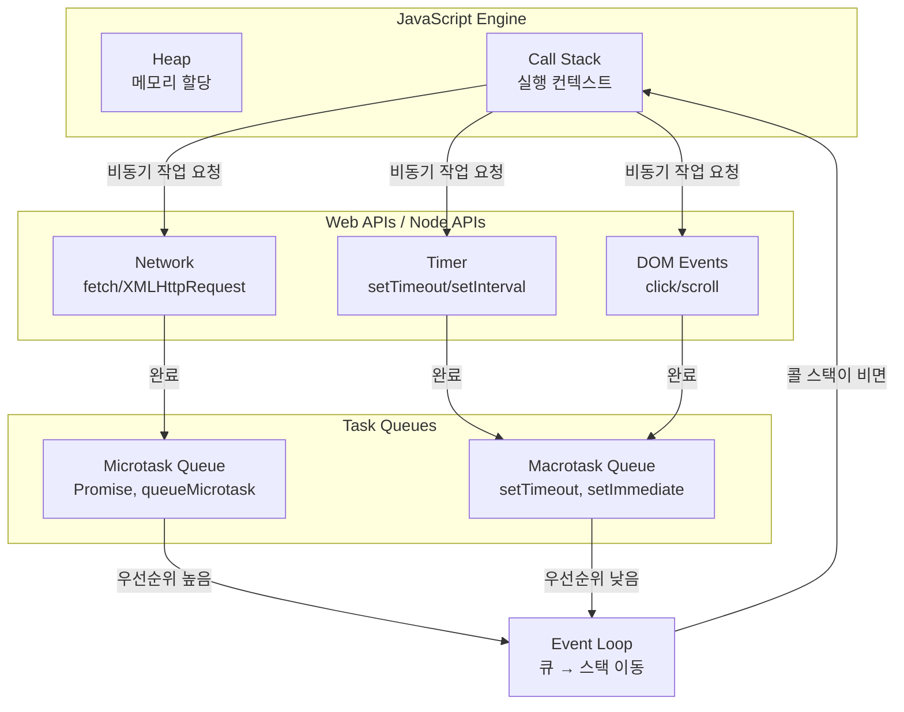
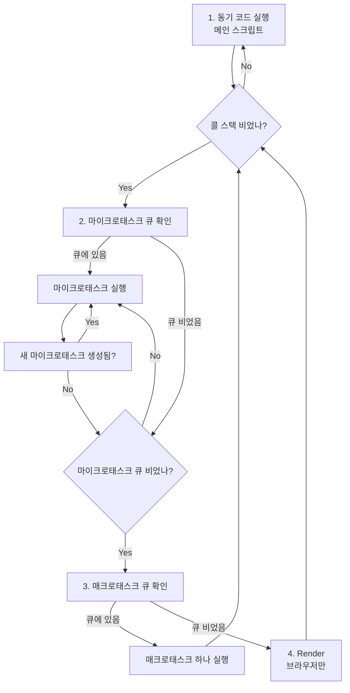
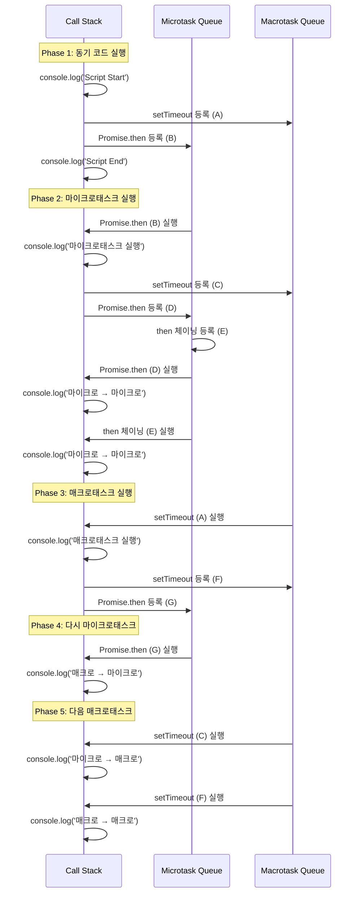
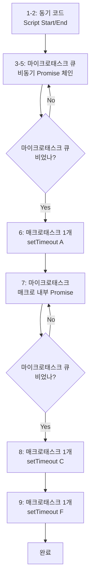

# 이벤트 루프와 비동기 처리

> JavaScript의 싱글 스레드 비동기 처리 메커니즘

## 들어가며

JavaScript는 싱글 스레드 언어다. 하나의 콜 스택만 가지고 있어서 한 번에 하나의 작업만 처리할 수 있다. 그런데 어떻게 네트워크 요청을 기다리면서 동시에 사용자 인터랙션을 처리할 수 있을까?

답은 **이벤트 루프**와 **비동기 처리 메커니즘**에 있다.

이 문서는 내가 JavaScript의 동작 원리를 이해하기 위해 정리한 내용이다. 주요 질문은:

- **동기/비동기**와 **블로킹/논블로킹**은 무엇이 다른가?
- **콜 스택**, **태스크 큐**, **마이크로태스크 큐**는 어떻게 동작하는가?
- **매크로태스크**와 **마이크로태스크**의 우선순위는?
- 코드 실행 순서를 어떻게 예측할 수 있는가?

---

## 1. 동기/비동기 vs 블로킹/논블로킹

이 두 개념은 자주 혼동되지만, 서로 다른 관점을 다룬다.

### 동기(Synchronous) vs 비동기(Asynchronous)

**호출된 함수의 작업 완료를 누가 신경 쓰는가?**

```javascript
// 동기: 작업이 완료될 때까지 대기
function syncTask() {
    const result = heavyCalculation();  // 완료될 때까지 기다림
    console.log(result);
    return result;
}

// 비동기: 작업을 요청하고 나중에 결과를 받음
function asyncTask() {
    setTimeout(() => {
        console.log('완료!');
    }, 1000);
    console.log('요청 완료');  // 즉시 실행
}
```

**동기**:
- 호출한 쪽이 결과를 기다림
- 작업이 완료되어야 다음 코드 실행
- 예: 일반 함수 호출, `for` 루프

**비동기**:
- 호출한 쪽은 기다리지 않고 진행
- 작업 완료 시 콜백/Promise로 결과 전달
- 예: `setTimeout`, `fetch`, `Promise`

### 블로킹(Blocking) vs 논블로킹(Non-blocking)

**호출된 함수가 제어권을 즉시 반환하는가?**

```javascript
// 블로킹: 제어권을 바로 반환하지 않음
const data = fs.readFileSync('file.txt');  // 파일 읽을 때까지 대기
console.log(data);

// 논블로킹: 제어권을 즉시 반환
fs.readFile('file.txt', (err, data) => {  // 즉시 반환, 나중에 콜백 실행
    console.log(data);
});
console.log('다른 작업');  // 즉시 실행
```

**블로킹**:
- 함수가 완료될 때까지 제어권을 반환하지 않음
- 호출자는 기다릴 수밖에 없음

**논블로킹**:
- 함수가 즉시 제어권을 반환
- 작업은 백그라운드에서 진행

### 조합 예시

| 조합 | 설명 | 예시 |
|-----|------|------|
| **동기 + 블로킹** | 작업 완료까지 대기, 제어권 반환 안 함 | `fs.readFileSync()` |
| **비동기 + 논블로킹** | 작업 요청 후 즉시 반환, 나중에 콜백 | `setTimeout()`, `fetch()` |
| **동기 + 논블로킹** | 즉시 반환하지만 결과를 계속 확인 | 폴링(polling) |
| **비동기 + 블로킹** | 드물지만 가능 | 비동기 함수 내에서 동기 작업 |

**JavaScript는 주로 "비동기 + 논블로킹" 패턴을 사용한다.**

---

## 2. JavaScript 런타임 구조

JavaScript 엔진(V8, SpiderMonkey 등)과 런타임 환경(브라우저, Node.js)의 구조를 이해해야 한다.



### 주요 구성 요소

#### 1. Call Stack (콜 스택)
```javascript
function first() {
    second();
    console.log('첫 번째');
}

function second() {
    console.log('두 번째');
}

first();

// 콜 스택 동작:
// 1. [first]
// 2. [first, second]
// 3. [first]  <- second 실행 완료
// 4. []       <- first 실행 완료
```

- 실행 중인 함수를 추적하는 스택 구조
- LIFO (Last In, First Out)
- JavaScript는 싱글 스레드이므로 **하나의 콜 스택만 존재**

#### 2. Heap (힙)
- 객체가 저장되는 메모리 영역
- 구조화되지 않은 넓은 메모리 공간

#### 3. Web APIs / Node APIs
- 브라우저 또는 Node.js가 제공하는 API
- `setTimeout`, `fetch`, DOM 이벤트 등
- **별도 스레드**에서 실행 (JavaScript 스레드와 독립적)

#### 4. Task Queues (태스크 큐)
- **Macrotask Queue**: `setTimeout`, `setInterval`, I/O
- **Microtask Queue**: `Promise`, `queueMicrotask`, `MutationObserver`

#### 5. Event Loop (이벤트 루프)
- 콜 스택과 큐를 감시
- 콜 스택이 비면 큐의 작업을 스택으로 이동

---

## 3. 이벤트 루프 동작 원리

이벤트 루프는 단순한 무한 루프다:

```javascript
while (true) {
    // 1. 콜 스택이 비어있는가?
    if (callStack.isEmpty()) {

        // 2. 마이크로태스크 큐 확인 (우선순위 높음)
        if (!microtaskQueue.isEmpty()) {
            const task = microtaskQueue.dequeue();
            callStack.push(task);
            execute(task);
        }

        // 3. 마이크로태스크 큐가 비면 매크로태스크 큐 확인
        else if (!macrotaskQueue.isEmpty()) {
            const task = macrotaskQueue.dequeue();
            callStack.push(task);
            execute(task);
        }
    }
}
```

### 실행 순서



### 핵심 규칙

1. **동기 코드가 최우선**
   - 메인 스크립트의 동기 코드가 먼저 실행

2. **마이크로태스크가 매크로태스크보다 우선**
   - 콜 스택이 비면 마이크로태스크 큐를 먼저 확인

3. **마이크로태스크는 큐가 빌 때까지 실행**
   - 마이크로태스크 실행 중 새로운 마이크로태스크가 추가되면 즉시 실행

4. **매크로태스크는 한 번에 하나씩**
   - 매크로태스크 하나 실행 후 다시 마이크로태스크 큐 확인

---

## 4. 매크로태스크 vs 마이크로태스크

### 매크로태스크 (Macrotask)

**큰 단위의 작업, 한 번에 하나씩 처리**

```javascript
// 매크로태스크 생성
setTimeout(() => {
    console.log('매크로태스크');
}, 0);

setInterval(() => {
    console.log('매크로태스크 반복');
}, 1000);

// Node.js
setImmediate(() => {
    console.log('매크로태스크');
});
```

**특징**:
- 태스크 큐 (Task Queue)에 추가
- 한 번에 하나씩 실행
- 실행 후 마이크로태스크 큐 확인
- 예: `setTimeout`, `setInterval`, `setImmediate`, I/O, UI 렌더링

### 마이크로태스크 (Microtask)

**작은 단위의 작업, 큐가 빌 때까지 연속 실행**

```javascript
// 마이크로태스크 생성
Promise.resolve().then(() => {
    console.log('마이크로태스크');
});

queueMicrotask(() => {
    console.log('마이크로태스크');
});

// async/await도 Promise 기반
async function asyncFunc() {
    await Promise.resolve();  // 마이크로태스크
    console.log('마이크로태스크');
}
```

**특징**:
- 마이크로태스크 큐 (Microtask Queue)에 추가
- 큐가 빌 때까지 연속 실행
- 매크로태스크보다 우선순위 높음
- 예: `Promise.then/catch/finally`, `queueMicrotask`, `MutationObserver`, `process.nextTick` (Node.js)

### 우선순위 비교

```javascript
setTimeout(() => console.log('매크로태스크'), 0);

Promise.resolve().then(() => console.log('마이크로태스크'));

console.log('동기 코드');

// 출력 순서:
// 1. 동기 코드
// 2. 마이크로태스크
// 3. 매크로태스크
```

**이유**:
1. 동기 코드가 먼저 실행 (콜 스택)
2. 콜 스택이 비면 마이크로태스크 큐 확인
3. 마이크로태스크 큐가 비면 매크로태스크 큐 확인

---

## 5. 실제 코드 실행 분석

제공하신 예제를 단계별로 분석해보자.

```javascript
// 메인 스크립트 실행 공간
console.log('[ 메인 스크립트 - 동기 ] Script Start');

// 매크로태스크 등록
setTimeout(() => {
  console.log('[ 매크로태스크 ] 실행');

  setTimeout(() => {
    console.log('[ 매크로태스크 ] → [ 매크로태스크 ] 실행');
  }, 0);

  Promise.resolve().then(() => {
    console.log('[ 매크로태스크 ] → [ 마이크로태스크 ] 실행');
  });

}, 0);

// 마이크로태스크 등록
Promise.resolve().then(() => {
  console.log('[ 마이크로태스크 ] 실행');

  setTimeout(() => {
    console.log('[ 마이크로태스크 ] → [ 매크로태스크 ] 실행');
  }, 0);

  Promise.resolve().then(() => {
    console.log('[ 마이크로태스크 ] → [ 마이크로태스크 ] 실행');
  });

}).then(() => {
  console.log('[ 마이크로태스크 ] → [ 마이크로태스크 ] 실행');
});

// 메인 스크립트 실행 공간
console.log('[ 메인 스크립트 - 동기 ] Script End');
```

### 단계별 실행 순서



### 상세 분석

#### Phase 1: 동기 코드 실행 (메인 스크립트)

**콜 스택**:
```
[메인 스크립트]
```

**실행**:
1. `console.log('[ 메인 스크립트 - 동기 ] Script Start')` ✅ 출력
2. `setTimeout(..., 0)` → 매크로태스크 큐에 추가 (A)
3. `Promise.resolve().then(...)` → 마이크로태스크 큐에 추가 (B)
4. `.then(...)` → 마이크로태스크 큐에 추가 예약 (B의 체이닝)
5. `console.log('[ 메인 스크립트 - 동기 ] Script End')` ✅ 출력

**큐 상태**:
- **Microtask Queue**: [B]
- **Macrotask Queue**: [A]

**출력**:
```
[ 메인 스크립트 - 동기 ] Script Start
[ 메인 스크립트 - 동기 ] Script End
```

---

#### Phase 2: 마이크로태스크 실행

콜 스택이 비었으므로 **마이크로태스크 큐**를 확인한다.

**2-1. 첫 번째 마이크로태스크 (B) 실행**:

```javascript
Promise.resolve().then(() => {
  console.log('[ 마이크로태스크 ] 실행');  // ✅ 출력

  setTimeout(() => {
    console.log('[ 마이크로태스크 ] → [ 매크로태스크 ] 실행');
  }, 0);  // 매크로태스크 큐에 추가 (C)

  Promise.resolve().then(() => {
    console.log('[ 마이크로태스크 ] → [ 마이크로태스크 ] 실행');
  });  // 마이크로태스크 큐에 추가 (D)
})
```

**큐 상태**:
- **Microtask Queue**: [D, E]  (E는 B의 체이닝)
- **Macrotask Queue**: [A, C]

**출력**:
```
[ 마이크로태스크 ] 실행
```

**2-2. 두 번째 마이크로태스크 (D) 실행**:

```javascript
Promise.resolve().then(() => {
  console.log('[ 마이크로태스크 ] → [ 마이크로태스크 ] 실행');  // ✅ 출력
});
```

**큐 상태**:
- **Microtask Queue**: [E]
- **Macrotask Queue**: [A, C]

**출력**:
```
[ 마이크로태스크 ] → [ 마이크로태스크 ] 실행
```

**2-3. 세 번째 마이크로태스크 (E - 체이닝) 실행**:

```javascript
.then(() => {
  console.log('[ 마이크로태스크 ] → [ 마이크로태스크 ] 실행');  // ✅ 출력
});
```

**큐 상태**:
- **Microtask Queue**: []  (비었음!)
- **Macrotask Queue**: [A, C]

**출력**:
```
[ 마이크로태스크 ] → [ 마이크로태스크 ] 실행
```

**중요**: 마이크로태스크 큐가 완전히 빌 때까지 계속 실행한다. 마이크로태스크 실행 중 새로운 마이크로태스크가 추가되어도 즉시 실행된다.

---

#### Phase 3: 첫 번째 매크로태스크 실행 (A)

마이크로태스크 큐가 비었으므로 **매크로태스크 큐**를 확인한다.

```javascript
setTimeout(() => {
  console.log('[ 매크로태스크 ] 실행');  // ✅ 출력

  setTimeout(() => {
    console.log('[ 매크로태스크 ] → [ 매크로태스크 ] 실행');
  }, 0);  // 매크로태스크 큐에 추가 (F)

  Promise.resolve().then(() => {
    console.log('[ 매크로태스크 ] → [ 마이크로태스크 ] 실행');
  });  // 마이크로태스크 큐에 추가 (G)

}, 0);
```

**큐 상태**:
- **Microtask Queue**: [G]
- **Macrotask Queue**: [C, F]

**출력**:
```
[ 매크로태스크 ] 실행
```

**중요**: 매크로태스크는 **하나만 실행**하고 다시 마이크로태스크 큐를 확인한다.

---

#### Phase 4: 마이크로태스크 실행 (G)

매크로태스크 실행 후 다시 마이크로태스크 큐를 확인한다.

```javascript
Promise.resolve().then(() => {
  console.log('[ 매크로태스크 ] → [ 마이크로태스크 ] 실행');  // ✅ 출력
});
```

**큐 상태**:
- **Microtask Queue**: []  (비었음!)
- **Macrotask Queue**: [C, F]

**출력**:
```
[ 매크로태스크 ] → [ 마이크로태스크 ] 실행
```

---

#### Phase 5: 두 번째 매크로태스크 실행 (C)

```javascript
setTimeout(() => {
  console.log('[ 마이크로태스크 ] → [ 매크로태스크 ] 실행');  // ✅ 출력
}, 0);
```

**큐 상태**:
- **Microtask Queue**: []
- **Macrotask Queue**: [F]

**출력**:
```
[ 마이크로태스크 ] → [ 매크로태스크 ] 실행
```

---

#### Phase 6: 세 번째 매크로태스크 실행 (F)

```javascript
setTimeout(() => {
  console.log('[ 매크로태스크 ] → [ 매크로태스크 ] 실행');  // ✅ 출력
}, 0);
```

**큐 상태**:
- **Microtask Queue**: []
- **Macrotask Queue**: []  (모두 완료!)

**출력**:
```
[ 매크로태스크 ] → [ 매크로태스크 ] 실행
```

---

### 최종 출력 순서

```
1. [ 메인 스크립트 - 동기 ] Script Start
2. [ 메인 스크립트 - 동기 ] Script End
3. [ 마이크로태스크 ] 실행
4. [ 마이크로태스크 ] → [ 마이크로태스크 ] 실행
5. [ 마이크로태스크 ] → [ 마이크로태스크 ] 실행
6. [ 매크로태스크 ] 실행
7. [ 매크로태스크 ] → [ 마이크로태스크 ] 실행
8. [ 마이크로태스크 ] → [ 매크로태스크 ] 실행
9. [ 매크로태스크 ] → [ 매크로태스크 ] 실행
```

### 실행 순서 요약 다이어그램



---

## 6. 핵심 원칙 정리

### 실행 순서의 철칙

1. **동기 코드가 항상 최우선**
   - 메인 스크립트의 동기 코드부터 실행

2. **마이크로태스크 > 매크로태스크**
   - 콜 스택이 비면 마이크로태스크 큐를 먼저 확인

3. **마이크로태스크는 큐가 빌 때까지**
   - 마이크로태스크 실행 중 새로운 마이크로태스크 추가되면 즉시 실행
   - 무한 루프 주의!

4. **매크로태스크는 한 번에 하나**
   - 매크로태스크 하나 실행 후 다시 마이크로태스크 큐 확인

5. **이벤트 루프는 콜 스택이 빌 때만 동작**
   - 동기 코드 실행 중에는 큐를 확인하지 않음

### 태스크 분류

| 분류 | API | 우선순위 |
|-----|-----|---------|
| **동기** | 일반 함수, `for` 루프, `console.log` | 최우선 |
| **마이크로태스크** | `Promise.then/catch/finally`, `queueMicrotask`, `async/await` | 높음 |
| **매크로태스크** | `setTimeout`, `setInterval`, `setImmediate`, I/O | 낮음 |

### 디버깅 팁

```javascript
// 실행 순서를 추적하려면
function log(message, type) {
    console.log(`[${type}] ${message}`);
}

// 동기
log('동기 코드', 'SYNC');

// 마이크로태스크
Promise.resolve().then(() => log('마이크로태스크', 'MICRO'));

// 매크로태스크
setTimeout(() => log('매크로태스크', 'MACRO'), 0);
```

### 흔한 실수

**❌ `setTimeout(..., 0)`이 즉시 실행될 것이라 착각**
```javascript
setTimeout(() => console.log('나중'), 0);
console.log('먼저');

// 출력:
// 먼저
// 나중
```

이유: `setTimeout`은 매크로태스크이므로 동기 코드 이후 실행

**❌ Promise 체이닝이 동기적으로 실행될 것이라 착각**
```javascript
Promise.resolve()
    .then(() => console.log('1'))
    .then(() => console.log('2'));

console.log('3');

// 출력:
// 3
// 1
// 2
```

이유: `then`은 마이크로태스크이므로 동기 코드 이후 실행

**❌ 마이크로태스크 무한 루프**
```javascript
function loop() {
    Promise.resolve().then(loop);  // 무한 마이크로태스크 생성
}

loop();

setTimeout(() => {
    console.log('이건 절대 실행 안 됨');  // 매크로태스크는 기회를 못 얻음
}, 0);
```

이유: 마이크로태스크 큐가 절대 비지 않으므로 매크로태스크는 실행되지 않음

---

## 7. async/await와 이벤트 루프

`async/await`는 Promise의 문법적 설탕이다. 내부적으로 마이크로태스크를 사용한다.

```javascript
async function asyncFunc() {
    console.log('1');

    await Promise.resolve();  // 마이크로태스크

    console.log('2');  // 마이크로태스크로 실행됨
}

asyncFunc();
console.log('3');

// 출력:
// 1
// 3
// 2
```

**동작 원리**:
```javascript
// 위 코드는 내부적으로 이렇게 변환됨
function asyncFunc() {
    console.log('1');

    return Promise.resolve()
        .then(() => {
            console.log('2');
        });
}
```

`await` 이후의 코드는 `.then()` 안으로 들어가므로 마이크로태스크로 실행된다.

---

## 8. 실무에서의 활용

### API 호출 순서 제어

```javascript
// 나쁜 예: 순차적으로 기다림
async function loadData() {
    const user = await fetch('/user');      // 1초
    const posts = await fetch('/posts');    // 1초
    const comments = await fetch('/comments'); // 1초
    // 총 3초
}

// 좋은 예: 병렬 실행
async function loadData() {
    const [user, posts, comments] = await Promise.all([
        fetch('/user'),
        fetch('/posts'),
        fetch('/comments')
    ]);
    // 총 1초 (가장 느린 요청 기준)
}
```

### 우선순위 제어

```javascript
// 긴급한 작업은 마이크로태스크로
function urgentTask() {
    queueMicrotask(() => {
        console.log('긴급 작업');
    });
}

// 일반 작업은 매크로태스크로
function normalTask() {
    setTimeout(() => {
        console.log('일반 작업');
    }, 0);
}

urgentTask();
normalTask();

// 출력:
// 긴급 작업
// 일반 작업
```

### 렌더링 최적화 (브라우저)

```javascript
// 나쁜 예: 동기적으로 DOM 조작
for (let i = 0; i < 1000; i++) {
    document.body.innerHTML += `<div>${i}</div>`;  // 1000번 렌더링
}

// 좋은 예: 한 번에 DOM 조작
const fragment = document.createDocumentFragment();
for (let i = 0; i < 1000; i++) {
    const div = document.createElement('div');
    div.textContent = i;
    fragment.appendChild(div);
}
document.body.appendChild(fragment);  // 1번 렌더링
```

---

## 마치며

JavaScript의 이벤트 루프는 단순하면서도 강력하다. **싱글 스레드**임에도 **비동기 논블로킹**으로 동작하여 효율적인 I/O 처리가 가능하다.

핵심은 **실행 순서**를 이해하는 것이다:
1. 동기 코드
2. 마이크로태스크 (큐가 빌 때까지)
3. 매크로태스크 (하나만)
4. 반복

이 원칙만 기억하면 복잡한 비동기 코드도 실행 순서를 예측할 수 있다.

중요한 건 **왜 이런 순서로 실행되는가**를 이해하는 것이다. 단순히 암기하지 말고, 콜 스택과 큐의 동작을 머릿속으로 시뮬레이션해보자.

JavaScript를 정말 이해하려면 이벤트 루프를 이해해야 한다. 이것이 JavaScript가 비동기를 처리하는 방식이기 때문이다.
