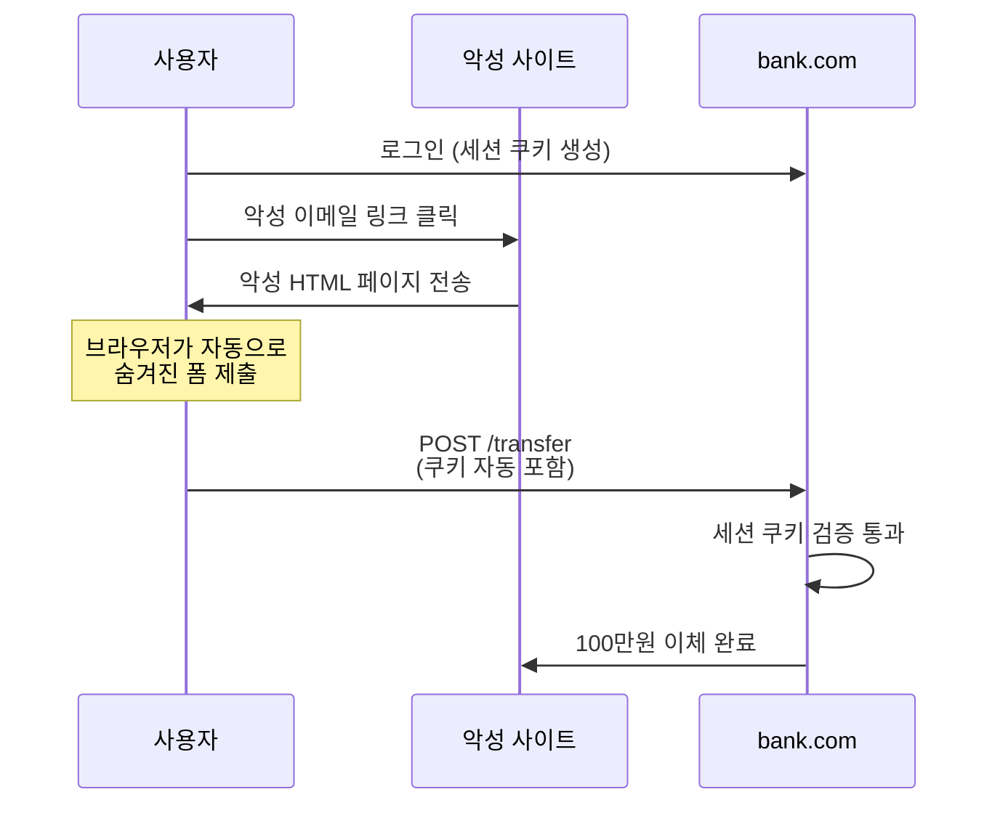
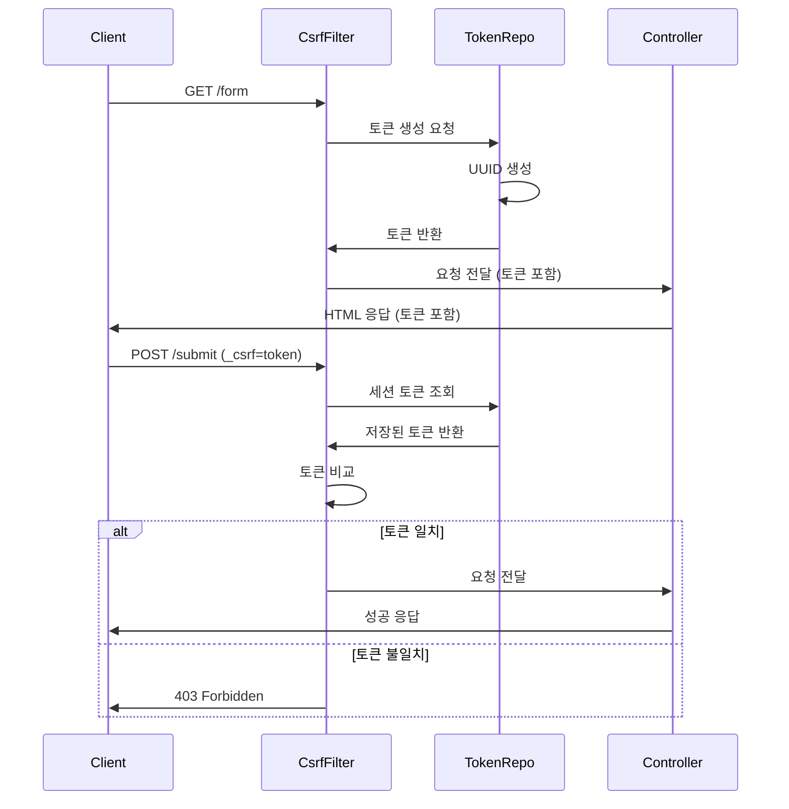

# CSRF 공격과 방어 전략

> 웹 보안의 핵심 취약점과 Spring Security 기반 방어 메커니즘

## 들어가며

CSRF는 웹 애플리케이션에서 가장 빈번하게 발생하는 보안 취약점 중 하나다.
사용자가 의도하지 않은 행위를 강제로 실행시키는 이 공격은 실제로 TikTok, eBay, McAfee 등 대형 서비스에서도 발생했다.
이 문서는 CSRF의 동작 원리부터 Spring Security의 방어 메커니즘까지 다룬다.

주요 니즈는 다음과 같았다:
- **공격 원리 이해**: CSRF가 어떻게 동작하는지 구체적 예시로 파악
- **현실적인 방어**: 이론이 아닌 실전에서 적용 가능한 방어 전략
- **Spring Security 활용**: 프레임워크 레벨에서 자동으로 보호하는 방법

---

## 1. CSRF란 무엇인가

### 핵심 개념

CSRF(Cross-Site Request Forgery)는 **공격자가 피해자의 권한을 도용해 의도하지 않은 요청을 강제로 실행**시키는 공격이다.

핵심은 **브라우저의 자동 인증 메커니즘**을 악용한다는 점이다.
브라우저는 특정 도메인에 요청을 보낼 때 해당 도메인의 쿠키를 자동으로 포함한다.
공격자는 이를 이용해 사용자가 인증된 상태에서 악의적 요청을 실행시킨다.

### 실생활 비유

이를 은행 업무에 비유하면:
- **세션 쿠키** = 은행 통장과 도장
- **CSRF 공격** = 타인이 내 통장과 도장을 몰래 사용해 출금 요청서를 제출
- **CSRF 토큰** = 본인만 아는 추가 서명 (도장만으로는 출금 불가)

---

## 2. CSRF 공격 시나리오

### 시나리오 1: 은행 계좌 이체

**전제 조건:**
- 사용자는 bank.com에 로그인된 상태
- 브라우저에 bank.com의 세션 쿠키 보관 중

**공격 과정:**



**악성 HTML 코드:**

```html
<html>
<body>
  <h1>축하합니다! 경품에 당첨되셨습니다!</h1>

  <form id="evil-form" action="https://bank.com/transfer" method="POST" style="display:none">
    <input type="hidden" name="to" value="attacker-account">
    <input type="hidden" name="amount" value="1000000">
  </form>

  <script>
    document.getElementById('evil-form').submit();
  </script>
</body>
</html>
```

사용자는 경품 당첨 페이지를 열었을 뿐인데, 백그라운드에서 은행 이체가 실행된다.
브라우저는 bank.com으로 요청을 보낼 때 자동으로 세션 쿠키를 포함하기 때문이다.

### 시나리오 2: 소셜 미디어 계정 탈취

**공격 과정:**

```html

```

사용자가 악성 페이지를 방문하면 `` 태그가 로드되면서 GET 요청이 발생한다.
social.com에 로그인된 상태라면 이메일이 변경되고, 공격자는 비밀번호 재설정으로 계정을 탈취한다.

**이것이 바로 상태 변경 작업에 GET을 사용하면 안 되는 이유다.**

### 시나리오 3: SNS 스팸 게시물 작성

**전제 조건:**
- 사용자는 sns.com에 로그인된 상태

**공격 HTML:**

```html
<html>
<body>
  <h1>당신은 어떤 연예인과 닮았을까요?</h1>
  <button onclick="startQuiz()">퀴즈 시작</button>

  <script>
    function startQuiz() {
      fetch('https://sns.com/api/posts', {
        method: 'POST',
        credentials: 'include',
        headers: { 'Content-Type': 'application/json' },
        body: JSON.stringify({
          content: '이 퀴즈 대박이네요! http://evil.com/quiz'
        })
      });

      location.href = '/quiz-result.html';
    }
  </script>
</body>
</html>
```

사용자는 단순히 퀴즈를 시작했을 뿐인데, SNS 타임라인에 스팸 게시물이 작성된다.
`credentials: 'include'` 옵션으로 쿠키가 자동으로 포함되기 때문이다.

### 시나리오 4: 관리자 계정 생성

**공격 대상:** 관리자 계정

**악성 코드:**

```html
<form action="https://admin.company.com/users/create" method="POST" style="display:none">
  <input type="hidden" name="username" value="attacker">
  <input type="hidden" name="password" value="hacked123">
  <input type="hidden" name="role" value="ADMIN">
</form>

<script>
  document.forms[0].submit();
</script>
```

관리자가 악성 페이지를 열면 새로운 관리자 계정이 생성된다.
CSRF 공격이 관리자를 대상으로 하면 **시스템 전체가 장악**될 수 있다.

---

## 3. CSRF가 성공하는 이유

### 브라우저의 자동 인증

브라우저는 다음 요청 시 자동으로 쿠키를 포함한다:
- 일반 폼 제출 (POST)
- 이미지, 스크립트 로드 (GET)
- fetch/XMLHttpRequest with credentials

### Same-Origin Policy의 한계

SOP(Same-Origin Policy)는 **응답 읽기**는 막지만 **요청 전송**은 허용한다.

```
evil.com에서 bank.com으로 요청 전송 → ✅ 가능
evil.com에서 bank.com의 응답 읽기 → ❌ 불가능
```

CSRF 공격은 응답을 읽을 필요가 없다.
요청만 전송되면 서버에서 작업이 실행되기 때문이다.

### 상태 변경을 GET으로 처리

```java
@GetMapping("/delete-account")
public String deleteAccount() {
    userService.deleteCurrentUser();
    return "redirect:/";
}
```

이 경우 단순히 링크 클릭이나 이미지 태그만으로도 계정이 삭제된다.

```html

```

---

## 4. CSRF 방어 전략

### 전략 1: CSRF 토큰 (Synchronizer Token Pattern)

**핵심 원리:**
- 서버가 예측 불가능한 토큰을 생성해 세션에 저장
- 클라이언트는 모든 상태 변경 요청에 이 토큰을 포함
- 서버는 세션의 토큰과 요청의 토큰을 비교

**왜 효과적인가?**

브라우저는 쿠키를 자동으로 포함하지만, 토큰은 자동으로 포함하지 않는다.
공격자는 다른 도메인에서 토큰 값을 알 수 없다 (SOP에 의해 차단).

**HTML 폼 예시:**

```html
<form action="/transfer" method="POST">
  <input type="hidden" name="_csrf" value="4bfd1575-3ad1-4d21-96c7-4ef2d9f86721">
  <input name="to" value="...">
  <input name="amount" value="...">
  <button type="submit">이체</button>
</form>
```

**AJAX 요청 예시:**

```javascript
fetch('/api/transfer', {
  method: 'POST',
  headers: {
    'Content-Type': 'application/json',
    'X-CSRF-TOKEN': document.querySelector('meta[name="_csrf"]').content
  },
  body: JSON.stringify({ to: '...', amount: 1000 })
});
```

### 전략 2: SameSite 쿠키 속성

**원리:**

쿠키에 `SameSite` 속성을 설정해 외부 사이트에서의 요청에 쿠키 포함을 제한한다.

**옵션:**

| 값 | 동작 | 사용 시나리오 |
|---|------|-------------|
| **Strict** | 같은 사이트 요청에만 쿠키 전송 | 높은 보안이 필요한 경우 (은행) |
| **Lax** | 같은 사이트 + 안전한 최상위 탐색 | 일반적인 웹 애플리케이션 (기본값) |
| **None** | 모든 요청에 쿠키 전송 (Secure 필수) | 크로스 사이트 요청이 필요한 경우 |

**설정 예시:**

```java
@Bean
public SecurityFilterChain filterChain(HttpSecurity http) {
    http.sessionManagement(session ->
        session.sessionCreationPolicy(SessionCreationPolicy.IF_REQUIRED)
            .cookie(cookie -> cookie.sameSite("Lax"))
    );
    return http.build();
}
```

**Strict vs Lax 차이:**

```
Strict:
외부 사이트 링크 클릭 → bank.com 이동 → 쿠키 없음 (로그아웃 상태)

Lax:
외부 사이트 링크 클릭 → bank.com 이동 → 쿠키 있음 (로그인 유지)
악성 사이트 POST 요청 → bank.com → 쿠키 없음 (공격 차단)
```

나는 대부분 **Lax**를 사용한다.
사용자 경험을 해치지 않으면서 CSRF를 효과적으로 방어하기 때문이다.

### 전략 3: Double Submit Cookie

**원리:**

CSRF 토큰을 세션이 아닌 쿠키에 저장하고, 요청 시 쿠키 값과 파라미터/헤더 값을 비교한다.

**장점:**
- 서버 세션 불필요 (Stateless 아키텍처에 적합)
- 확장성 향상

**구현 예시:**

```java
@Component
public class DoubleCsrfTokenFilter extends OncePerRequestFilter {

    @Override
    protected void doFilterInternal(HttpServletRequest request,
                                   HttpServletResponse response,
                                   FilterChain chain) {

        if (isStateChangingRequest(request)) {
            String cookieToken = getCsrfTokenFromCookie(request);
            String headerToken = request.getHeader("X-CSRF-TOKEN");

            if (!cookieToken.equals(headerToken)) {
                throw new CsrfException("Invalid CSRF token");
            }
        }

        chain.doFilter(request, response);
    }
}
```

### 전략 4: Custom Request Header

**원리:**

AJAX 요청에 커스텀 헤더를 추가하도록 강제한다.
브라우저는 크로스 오리진 요청에 커스텀 헤더를 추가할 수 없다 (CORS에 의해 차단).

**구현:**

```javascript
fetch('/api/transfer', {
  method: 'POST',
  headers: {
    'X-Requested-With': 'XMLHttpRequest',
    'Content-Type': 'application/json'
  },
  body: JSON.stringify({ to: '...', amount: 1000 })
});
```

```java
if (!"XMLHttpRequest".equals(request.getHeader("X-Requested-With"))) {
    throw new SecurityException("Missing custom header");
}
```

**제약사항:**

일반 HTML 폼에는 적용 불가능하다. AJAX 전용 API에만 사용 가능하다.

### 전략 5: Referer/Origin 검증

**원리:**

요청의 `Origin` 또는 `Referer` 헤더를 검사해 허용된 도메인에서만 요청을 수락한다.

**구현:**

```java
String origin = request.getHeader("Origin");
if (origin != null && !origin.startsWith("https://myapp.com")) {
    throw new SecurityException("Invalid origin");
}
```

**단점:**
- Referer는 사용자가 설정에서 차단 가능
- 프록시 환경에서 헤더가 제거될 수 있음
- 보조 수단으로만 사용 권장

### 전략 비교

| 전략 | 보안성 | 복잡도 | Stateless | 권장도 |
|-----|-------|-------|-----------|--------|
| **CSRF 토큰** | ⭐⭐⭐⭐⭐ | 중간 | ❌ | 1순위 |
| **SameSite 쿠키** | ⭐⭐⭐⭐ | 낮음 | ✅ | 1순위 (보조) |
| **Double Submit** | ⭐⭐⭐⭐ | 중간 | ✅ | 2순위 |
| **Custom Header** | ⭐⭐⭐ | 낮음 | ✅ | API 전용 |
| **Referer 검증** | ⭐⭐ | 낮음 | ✅ | 보조 수단 |

---

## 5. Spring Security의 CSRF 방어

### 기본 동작 방식

Spring Security는 기본적으로 CSRF 보호를 활성화한다.

```java
@Bean
public SecurityFilterChain filterChain(HttpSecurity http) {
    http
        .csrf(Customizer.withDefaults());
    return http.build();
}
```

### 내부 동작 흐름



### CsrfFilter의 역할

**핵심 필터:**

```java
public class CsrfFilter extends OncePerRequestFilter {

    @Override
    protected void doFilterInternal(HttpServletRequest request,
                                   HttpServletResponse response,
                                   FilterChain filterChain) {

        CsrfToken csrfToken = this.tokenRepository.loadToken(request);
        boolean missingToken = (csrfToken == null);

        if (missingToken) {
            csrfToken = this.tokenRepository.generateToken(request);
            this.tokenRepository.saveToken(csrfToken, request, response);
        }

        request.setAttribute(CsrfToken.class.getName(), csrfToken);
        request.setAttribute(csrfToken.getParameterName(), csrfToken);

        if (!requiresCsrfProtection(request)) {
            filterChain.doFilter(request, response);
            return;
        }

        String actualToken = request.getHeader(csrfToken.getHeaderName());
        if (actualToken == null) {
            actualToken = request.getParameter(csrfToken.getParameterName());
        }

        if (!csrfToken.getToken().equals(actualToken)) {
            this.accessDeniedHandler.handle(request, response,
                new InvalidCsrfTokenException(csrfToken, actualToken));
            return;
        }

        filterChain.doFilter(request, response);
    }
}
```

**주요 동작:**

1. **토큰 로드/생성**: 세션에서 토큰을 조회하고, 없으면 새로 생성
2. **토큰 노출**: 요청 속성에 저장해 뷰에서 접근 가능하도록 설정
3. **검증 필요 여부 판단**: GET, HEAD, TRACE, OPTIONS는 스킵
4. **토큰 비교**: 요청의 토큰과 세션의 토큰 비교
5. **실패 처리**: 불일치 시 `AccessDeniedHandler` 호출 (403 응답)

### CsrfTokenRepository 구현

**기본 구현: HttpSessionCsrfTokenRepository**

```java
public class HttpSessionCsrfTokenRepository implements CsrfTokenRepository {

    private static final String DEFAULT_CSRF_PARAMETER_NAME = "_csrf";
    private static final String DEFAULT_CSRF_HEADER_NAME = "X-CSRF-TOKEN";
    private static final String DEFAULT_CSRF_TOKEN_ATTR_NAME =
        HttpSessionCsrfTokenRepository.class.getName().concat(".CSRF_TOKEN");

    @Override
    public CsrfToken generateToken(HttpServletRequest request) {
        return new DefaultCsrfToken(DEFAULT_CSRF_HEADER_NAME,
                                   DEFAULT_CSRF_PARAMETER_NAME,
                                   UUID.randomUUID().toString());
    }

    @Override
    public void saveToken(CsrfToken token, HttpServletRequest request,
                         HttpServletResponse response) {
        if (token == null) {
            request.getSession().removeAttribute(DEFAULT_CSRF_TOKEN_ATTR_NAME);
        } else {
            request.getSession().setAttribute(DEFAULT_CSRF_TOKEN_ATTR_NAME, token);
        }
    }

    @Override
    public CsrfToken loadToken(HttpServletRequest request) {
        return (CsrfToken) request.getSession()
            .getAttribute(DEFAULT_CSRF_TOKEN_ATTR_NAME);
    }
}
```

**쿠키 기반 구현: CookieCsrfTokenRepository**

```java
public class CookieCsrfTokenRepository implements CsrfTokenRepository {

    @Override
    public CsrfToken generateToken(HttpServletRequest request) {
        return new DefaultCsrfToken("X-CSRF-TOKEN", "_csrf",
                                   UUID.randomUUID().toString());
    }

    @Override
    public void saveToken(CsrfToken token, HttpServletRequest request,
                         HttpServletResponse response) {
        String tokenValue = (token != null) ? token.getToken() : "";
        Cookie cookie = new Cookie("XSRF-TOKEN", tokenValue);
        cookie.setPath("/");
        cookie.setHttpOnly(false);
        response.addCookie(cookie);
    }
}
```

**설정:**

```java
http.csrf(csrf -> csrf
    .csrfTokenRepository(CookieCsrfTokenRepository.withHttpOnlyFalse())
);
```

나는 SPA 환경에서는 **CookieCsrfTokenRepository**를,
전통적인 MVC에서는 **HttpSessionCsrfTokenRepository**를 사용한다.

### Thymeleaf 템플릿에서 토큰 사용

**자동 포함:**

```html
<form th:action="@{/transfer}" method="post">
  <input type="text" name="to">
  <input type="number" name="amount">
  <button type="submit">이체</button>
</form>
```

Thymeleaf는 `th:action`을 사용하면 자동으로 CSRF 토큰을 hidden 필드로 추가한다.

**수동 포함:**

```html
<form action="/transfer" method="post">
  <input type="hidden" th:name="${_csrf.parameterName}" th:value="${_csrf.token}">
  <button type="submit">이체</button>
</form>
```

### JavaScript/AJAX에서 토큰 사용

**메타 태그로 노출:**

```html
<head>
  <meta name="_csrf" th:content="${_csrf.token}">
  <meta name="_csrf_header" th:content="${_csrf.headerName}">
</head>
```

**JavaScript로 헤더 추가:**

```javascript
const token = document.querySelector('meta[name="_csrf"]').content;
const header = document.querySelector('meta[name="_csrf_header"]').content;

fetch('/api/transfer', {
  method: 'POST',
  headers: {
    'Content-Type': 'application/json',
    [header]: token
  },
  body: JSON.stringify({ to: 'account', amount: 1000 })
});
```

### REST API에서 CSRF 비활성화

**상황:**

REST API는 보통 Stateless하며 JWT 같은 토큰 기반 인증을 사용한다.
쿠키를 사용하지 않으므로 CSRF 위험이 없다.

**설정:**

```java
http.csrf(csrf -> csrf
    .ignoringRequestMatchers("/api/**")
);
```

**주의사항:**

JWT를 쿠키에 저장하면 CSRF 위험이 다시 발생한다.
이 경우 CSRF 보호를 유지해야 한다.

### CSRF와 로그인/로그아웃

**로그인 폼:**

```html
<form th:action="@{/login}" method="post">
  <input type="text" name="username">
  <input type="password" name="password">
  <button type="submit">로그인</button>
</form>
```

Spring Security는 로그인 엔드포인트에도 CSRF 보호를 적용한다.
로그인 CSRF 공격으로 공격자의 계정으로 로그인시켜 정보를 수집할 수 있기 때문이다.

**로그아웃:**

```html
<form th:action="@{/logout}" method="post">
  <button type="submit">로그아웃</button>
</form>
```

로그아웃도 POST 메서드를 사용하고 CSRF 토큰이 필요하다.
GET으로 로그아웃을 허용하면 이미지 태그만으로 강제 로그아웃이 가능하다.

---

## 6. 실무 관점의 주의사항

### 안전한 메서드의 순수성 유지

**절대 규칙:**

GET, HEAD, OPTIONS, TRACE 메서드는 **읽기 전용**이어야 한다.

```java
@GetMapping("/delete-account")
public String deleteAccount() {
    userService.deleteCurrentUser();
    return "redirect:/";
}
```

이 코드는 CSRF 토큰 없이도 공격 가능하다.
``만으로 계정이 삭제된다.

**올바른 방법:**

```java
@PostMapping("/delete-account")
public String deleteAccount() {
    userService.deleteCurrentUser();
    return "redirect:/";
}
```

### 파일 업로드와 CSRF

**문제:**

multipart 요청에서는 CSRF 토큰을 파라미터로 전달하기 어렵다.

**해결책 1: URL에 토큰 포함**

```html
<form th:action="@{/upload(${_csrf.parameterName}=${_csrf.token})}"
      method="post" enctype="multipart/form-data">
  <input type="file" name="file">
  <button type="submit">업로드</button>
</form>
```

**해결책 2: 헤더로 전달**

```javascript
const formData = new FormData();
formData.append('file', fileInput.files[0]);

fetch('/upload', {
  method: 'POST',
  headers: {
    'X-CSRF-TOKEN': document.querySelector('meta[name="_csrf"]').content
  },
  body: formData
});
```

### SPA (Single Page Application) 환경

**쿠키 기반 토큰 사용:**

```java
http.csrf(csrf -> csrf
    .csrfTokenRepository(CookieCsrfTokenRepository.withHttpOnlyFalse())
);
```

`HttpOnly=false`로 설정해 JavaScript에서 쿠키를 읽을 수 있게 한다.

**프론트엔드 설정:**

```javascript
const csrfToken = document.cookie
    .split('; ')
    .find(row => row.startsWith('XSRF-TOKEN='))
    ?.split('=')[1];

axios.defaults.headers.common['X-CSRF-TOKEN'] = csrfToken;
```

### 세션 타임아웃 처리

**문제:**

사용자가 오랜 시간 페이지에 머물다 폼을 제출하면 세션이 만료되어 CSRF 토큰이 유효하지 않다.

**해결책:**

```javascript
setInterval(() => {
  fetch('/csrf-token', { method: 'GET' })
    .then(response => response.json())
    .then(data => {
      document.querySelector('meta[name="_csrf"]').content = data.token;
    });
}, 10 * 60 * 1000);
```

10분마다 토큰을 갱신한다.

### 디버깅 전략

**CSRF 실패 로그 확인:**

```properties
logging.level.org.springframework.security.web.csrf=DEBUG
```

**커스텀 AccessDeniedHandler:**

```java
@Bean
public AccessDeniedHandler accessDeniedHandler() {
    return (request, response, ex) -> {
        if (ex instanceof InvalidCsrfTokenException) {
            log.warn("Invalid CSRF token: {}", ex.getMessage());
        }
        response.setStatus(HttpServletResponse.SC_FORBIDDEN);
        response.getWriter().write("{\"error\": \"CSRF token invalid\"}");
    };
}

http.exceptionHandling(ex ->
    ex.accessDeniedHandler(accessDeniedHandler())
);
```

### 환경별 설정

**개발 환경:**

```yaml
spring:
  security:
    csrf:
      enabled: false
```

개발 중 편의를 위해 비활성화할 수 있지만, 프로덕션에서는 반드시 활성화해야 한다.

**프로덕션 환경:**

```java
http.csrf(csrf -> csrf
    .csrfTokenRepository(CookieCsrfTokenRepository.withHttpOnlyFalse())
    .requireCsrfProtectionMatcher(
        new AntPathRequestMatcher("/api/**", "POST")
    )
);
```

---

## 7. 핵심 원칙 정리

### CSRF는 브라우저의 자동 인증을 악용한다

쿠키가 자동으로 포함되는 특성을 이용해 사용자 몰래 요청을 전송한다.

### 방어의 핵심은 "예측 불가능한 값"을 요구하는 것

CSRF 토큰, Custom Header 등 공격자가 알 수 없는 값을 요구한다.

### 안전한 메서드는 읽기 전용이어야 한다

GET으로 상태를 변경하면 CSRF 토큰 없이도 공격 가능하다.

### 다층 방어가 효과적이다

CSRF 토큰 + SameSite 쿠키 + HTTPS를 함께 사용한다.

### Spring Security는 기본적으로 보호한다

별도 설정 없이도 CSRF 방어가 활성화되어 있다.

---

## 마치며

CSRF는 오래된 공격 기법이지만 여전히 위험하다.
브라우저의 근본적인 동작 방식을 악용하기 때문에 완전히 사라지지 않는다.

Spring Security는 강력한 CSRF 방어 메커니즘을 제공한다.
기본 설정만으로도 대부분의 공격을 막을 수 있지만, 동작 원리를 이해하는 것이 중요하다.

중요한 건 **왜 CSRF가 발생하는가**를 이해하는 것이다.
세션 쿠키의 자동 포함, SOP의 한계, 안전한 메서드의 순수성 같은 근본 원리를 이해하면
새로운 공격 시나리오도 효과적으로 대응할 수 있다.

---

## 참고자료

- [Spring Security Reference - CSRF](https://docs.spring.io/spring-security/reference/features/exploits/csrf.html)
- [OWASP CSRF Prevention Cheat Sheet](https://cheatsheetseries.owasp.org/cheatsheets/Cross-Site_Request_Forgery_Prevention_Cheat_Sheet.html)
- [MDN - CSRF](https://developer.mozilla.org/en-US/docs/Web/Security/Attacks/CSRF)
- [PortSwigger - CSRF](https://portswigger.net/web-security/csrf)
