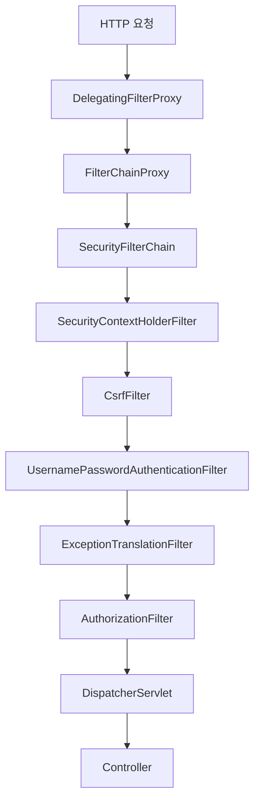
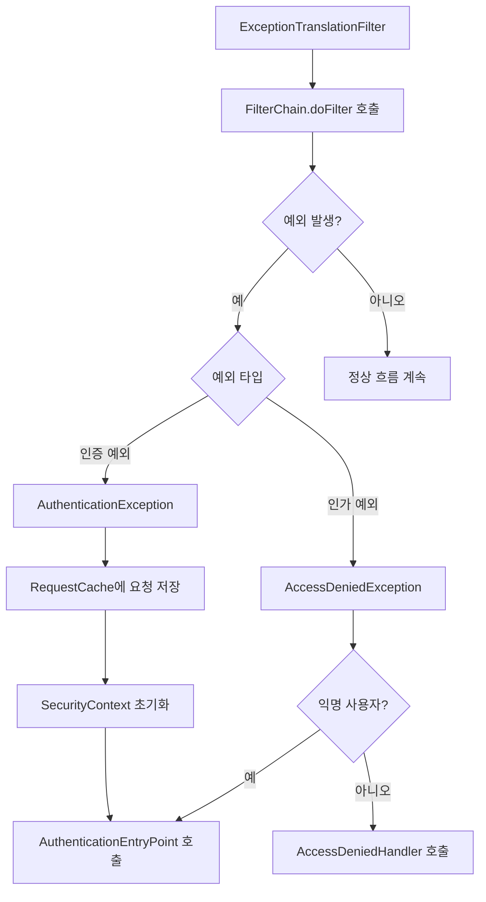

# Spring Security Filter Chain 예외 처리 전략

> 인증/인가 실패와 예외를 제대로 다루는 방법

## 들어가며

Spring Security를 사용하다 보면 예외 처리가 예상과 다르게 동작하는 경우가 많다. `@ControllerAdvice`로 정의한 전역 예외 핸들러가 작동하지 않고, 인증 실패 시 원하는 응답을 반환하지 못하는 상황을 겪었다. 문제는 Spring Security의 예외가 **필터 레벨**에서 발생한다는 점이었다.

이 글은 그 과정에서 학습한 Spring Security의 예외 처리 메커니즘을 정리한다.

주요 니즈는 다음과 같았다:
- **예외 흐름 이해**: 필터에서 발생하는 예외가 어떻게 처리되는가
- **인증/인가 실패 처리**: 각 상황에 맞는 적절한 응답 반환
- **커스텀 예외 핸들러**: 프로젝트 요구사항에 맞는 예외 처리 구현
- **ControllerAdvice와의 차이**: 왜 일반적인 예외 처리 방식이 통하지 않는가

---

## 1. 문제의 본질: 필터 vs 컨트롤러

### 일반적인 예외 처리 흐름

대부분의 Spring 애플리케이션에서는 `@ControllerAdvice`를 사용해 예외를 처리한다.

```java
@RestControllerAdvice
public class GlobalExceptionHandler {

    @ExceptionHandler(IllegalArgumentException.class)
    public ResponseEntity<ErrorResponse> handleIllegalArgument(IllegalArgumentException e) {
        return ResponseEntity.badRequest()
            .body(new ErrorResponse(e.getMessage()));
    }
}
```

이 방식은 **DispatcherServlet 이후**의 예외만 처리한다.

### Spring Security의 예외는 다르다

Spring Security의 필터들은 DispatcherServlet **이전**에 실행된다.

```
HTTP 요청
  ↓
필터 체인 (Spring Security 필터들)  ← 여기서 예외 발생!
  ↓
DispatcherServlet
  ↓
Controller
  ↓
@ControllerAdvice  ← 여기서는 처리 못함
```

**결론:** Spring Security 예외는 `@ControllerAdvice`로 처리할 수 없다. 필터 레벨에서 처리해야 한다.

---

## 2. Filter Chain의 구조

### 전체 아키텍처

Spring Security는 여러 필터가 체인 형태로 연결된 구조다.



### 주요 컴포넌트 역할

**FilterChainProxy**
- Spring Security의 진입점
- 어떤 SecurityFilterChain을 사용할지 결정
- SecurityContext 정리, HttpFirewall 적용 등 부가 기능 제공

**SecurityFilterChain**
- URL 패턴별로 적용할 필터 목록을 정의
- 여러 체인을 구성할 수 있으며, 첫 번째 매칭되는 체인만 실행

**Security Filters**
- 인증, 인가, CSRF 방어 등 보안 기능을 수행
- 정해진 순서대로 실행됨

### 필터 실행 순서

Spring Security 필터는 특정 순서로 실행되어야 한다.

| 순서 | 필터 | 역할 |
|-----|------|------|
| 1 | SecurityContextHolderFilter | SecurityContext 로드 |
| 2 | CsrfFilter | CSRF 토큰 검증 |
| 3 | UsernamePasswordAuthenticationFilter | 로그인 처리 |
| 4 | **ExceptionTranslationFilter** | **예외 처리** |
| 5 | AuthorizationFilter | 인가 검증 |

**ExceptionTranslationFilter가 핵심이다.** 이 필터가 인증/인가 예외를 처리한다.

---

## 3. 예외 처리 흐름

### ExceptionTranslationFilter의 동작 방식

ExceptionTranslationFilter는 **두 가지 예외만** 처리한다:
- `AuthenticationException`: 인증 실패
- `AccessDeniedException`: 인가 실패



### 인증 예외 처리 (AuthenticationException)

인증되지 않은 사용자가 보호된 리소스에 접근할 때:

1. **RequestCache에 요청 저장**
   - 인증 성공 후 원래 요청으로 돌아가기 위함
   - 기본 구현: `HttpSessionRequestCache`

2. **SecurityContext 초기화**
   - 현재 인증 정보를 제거

3. **AuthenticationEntryPoint 호출**
   - 클라이언트에게 인증을 요구
   - 로그인 페이지로 리다이렉트하거나 401 응답 반환

```java
public interface AuthenticationEntryPoint {
    void commence(HttpServletRequest request,
                  HttpServletResponse response,
                  AuthenticationException authException) throws IOException;
}
```

### 인가 예외 처리 (AccessDeniedException)

인증된 사용자가 권한이 부족한 리소스에 접근할 때:

1. **익명 사용자 여부 확인**
   - 익명 사용자라면 `AuthenticationEntryPoint` 호출
   - 인증된 사용자라면 `AccessDeniedHandler` 호출

2. **AccessDeniedHandler 호출**
   - 일반적으로 403 Forbidden 응답 반환

```java
public interface AccessDeniedHandler {
    void handle(HttpServletRequest request,
                HttpServletResponse response,
                AccessDeniedException accessDeniedException) throws IOException;
}
```

### 처리되지 않는 예외

**ExceptionTranslationFilter는 다른 예외를 처리하지 않는다.**

```java
try {
    filterChain.doFilter(request, response);
} catch (AuthenticationException | AccessDeniedException ex) {
    // 처리함
} catch (Exception ex) {
    // 처리하지 않음! 상위로 전파됨
}
```

`NullPointerException`, `IllegalArgumentException` 같은 일반 예외는 ExceptionTranslationFilter를 통과한다. 이런 예외를 처리하려면 별도의 필터가 필요하다.

---

## 4. 예외 처리 구현

### 기본 설정

Spring Security 설정에서 예외 핸들러를 등록한다.

```java
@Configuration
@EnableWebSecurity
public class SecurityConfig {

    @Bean
    public SecurityFilterChain filterChain(HttpSecurity http) throws Exception {
        http
            .exceptionHandling(exception -> exception
                .authenticationEntryPoint(customAuthenticationEntryPoint())
                .accessDeniedHandler(customAccessDeniedHandler())
            )
            .authorizeHttpRequests(auth -> auth
                .requestMatchers("/api/public/**").permitAll()
                .requestMatchers("/api/admin/**").hasRole("ADMIN")
                .anyRequest().authenticated()
            );

        return http.build();
    }

    @Bean
    public AuthenticationEntryPoint customAuthenticationEntryPoint() {
        return new CustomAuthenticationEntryPoint();
    }

    @Bean
    public AccessDeniedHandler customAccessDeniedHandler() {
        return new CustomAccessDeniedHandler();
    }
}
```

### 커스텀 AuthenticationEntryPoint 구현

인증 실패 시 JSON 응답을 반환하는 예시다.

```java
public class CustomAuthenticationEntryPoint implements AuthenticationEntryPoint {

    private final ObjectMapper objectMapper = new ObjectMapper();

    @Override
    public void commence(HttpServletRequest request,
                        HttpServletResponse response,
                        AuthenticationException authException) throws IOException {

        ErrorResponse errorResponse = ErrorResponse.builder()
            .status(HttpStatus.UNAUTHORIZED.value())
            .error("Unauthorized")
            .message(authException.getMessage())
            .path(request.getRequestURI())
            .timestamp(Instant.now())
            .build();

        response.setStatus(HttpStatus.UNAUTHORIZED.value());
        response.setContentType(MediaType.APPLICATION_JSON_VALUE);
        response.setCharacterEncoding(StandardCharsets.UTF_8.name());

        response.getWriter().write(objectMapper.writeValueAsString(errorResponse));
    }
}
```

**핵심 포인트:**
- `HttpServletResponse`를 직접 다룬다
- JSON 변환을 수동으로 처리해야 한다
- Spring MVC의 `ResponseEntity`를 사용할 수 없다

### 커스텀 AccessDeniedHandler 구현

인가 실패 시 JSON 응답을 반환하는 예시다.

```java
public class CustomAccessDeniedHandler implements AccessDeniedHandler {

    private final ObjectMapper objectMapper = new ObjectMapper();

    @Override
    public void handle(HttpServletRequest request,
                      HttpServletResponse response,
                      AccessDeniedException accessDeniedException) throws IOException {

        ErrorResponse errorResponse = ErrorResponse.builder()
            .status(HttpStatus.FORBIDDEN.value())
            .error("Forbidden")
            .message("접근 권한이 없습니다")
            .path(request.getRequestURI())
            .timestamp(Instant.now())
            .build();

        response.setStatus(HttpStatus.FORBIDDEN.value());
        response.setContentType(MediaType.APPLICATION_JSON_VALUE);
        response.setCharacterEncoding(StandardCharsets.UTF_8.name());

        response.getWriter().write(objectMapper.writeValueAsString(errorResponse));
    }
}
```

### ErrorResponse DTO

```java
@Getter
@Builder
public class ErrorResponse {
    private int status;
    private String error;
    private String message;
    private String path;
    private Instant timestamp;
}
```

### 일반 예외 처리 필터

ExceptionTranslationFilter가 처리하지 못하는 예외를 잡으려면 별도 필터가 필요하다.

```java
@Component
public class FilterExceptionHandler extends OncePerRequestFilter {

    private final ObjectMapper objectMapper;

    public FilterExceptionHandler(ObjectMapper objectMapper) {
        this.objectMapper = objectMapper;
    }

    @Override
    protected void doFilterInternal(HttpServletRequest request,
                                   HttpServletResponse response,
                                   FilterChain filterChain) throws ServletException, IOException {
        try {
            filterChain.doFilter(request, response);
        } catch (AuthenticationException | AccessDeniedException ex) {
            throw ex;
        } catch (Exception ex) {
            handleException(response, ex);
        }
    }

    private void handleException(HttpServletResponse response, Exception ex) throws IOException {
        ErrorResponse errorResponse = ErrorResponse.builder()
            .status(HttpStatus.INTERNAL_SERVER_ERROR.value())
            .error("Internal Server Error")
            .message(ex.getMessage())
            .timestamp(Instant.now())
            .build();

        response.setStatus(HttpStatus.INTERNAL_SERVER_ERROR.value());
        response.setContentType(MediaType.APPLICATION_JSON_VALUE);
        response.setCharacterEncoding(StandardCharsets.UTF_8.name());

        response.getWriter().write(objectMapper.writeValueAsString(errorResponse));
    }
}
```

**주의사항:**
- `AuthenticationException`과 `AccessDeniedException`은 다시 던져야 한다
- 이 예외들은 ExceptionTranslationFilter가 처리해야 하기 때문이다
- 그 외의 예외만 이 필터에서 처리한다

### 필터 등록

```java
@Configuration
@EnableWebSecurity
public class SecurityConfig {

    private final FilterExceptionHandler filterExceptionHandler;

    public SecurityConfig(FilterExceptionHandler filterExceptionHandler) {
        this.filterExceptionHandler = filterExceptionHandler;
    }

    @Bean
    public SecurityFilterChain filterChain(HttpSecurity http) throws Exception {
        http
            .addFilterBefore(filterExceptionHandler, UsernamePasswordAuthenticationFilter.class)
            .exceptionHandling(exception -> exception
                .authenticationEntryPoint(customAuthenticationEntryPoint())
                .accessDeniedHandler(customAccessDeniedHandler())
            );

        return http.build();
    }
}
```

FilterExceptionHandler를 필터 체인의 **앞쪽에 배치**한다. 이렇게 하면 뒤쪽 필터들에서 발생하는 모든 예외를 잡을 수 있다.

---

## 5. 실무 관점의 주의사항

### RequestCache 전략 선택

기본 `HttpSessionRequestCache`는 모든 요청을 세션에 저장한다. REST API에서는 불필요할 수 있다.

```java
@Bean
public SecurityFilterChain filterChain(HttpSecurity http) throws Exception {
    http
        .requestCache(cache -> cache
            .requestCache(new NullRequestCache())
        );

    return http.build();
}
```

**선택 기준:**
- **전통적인 웹 애플리케이션**: `HttpSessionRequestCache` 사용
  - 로그인 후 원래 페이지로 돌아가는 UX 제공
- **REST API**: `NullRequestCache` 사용
  - Stateless 특성 유지
  - 클라이언트가 재시도 로직 구현

### 로깅 전략

예외 처리 흐름을 디버깅하려면 로깅이 필수다.

```java
public class CustomAuthenticationEntryPoint implements AuthenticationEntryPoint {

    private static final Logger log = LoggerFactory.getLogger(CustomAuthenticationEntryPoint.class);

    @Override
    public void commence(HttpServletRequest request,
                        HttpServletResponse response,
                        AuthenticationException authException) throws IOException {

        log.warn("Authentication failed: {} - {}",
                 authException.getClass().getSimpleName(),
                 authException.getMessage());
        log.debug("Request URI: {}", request.getRequestURI());
        log.debug("Exception details: ", authException);

        // 응답 처리...
    }
}
```

**권장 로그 레벨:**
- `WARN`: 인증/인가 실패 사실
- `DEBUG`: 요청 URI, 예외 타입
- `TRACE`: 전체 스택 트레이스

Spring Security 자체 로그도 활용한다:

```yaml
logging:
  level:
    org.springframework.security: DEBUG
    org.springframework.security.web.FilterChainProxy: TRACE
```

`TRACE` 레벨에서는 각 필터의 호출 순서와 예외 발생 위치를 확인할 수 있다.

### 예외 메시지 노출 제어

프로덕션 환경에서는 상세한 예외 메시지를 노출하지 않는다.

```java
public class CustomAuthenticationEntryPoint implements AuthenticationEntryPoint {

    private final boolean includeDetailMessage;

    public CustomAuthenticationEntryPoint(boolean includeDetailMessage) {
        this.includeDetailMessage = includeDetailMessage;
    }

    @Override
    public void commence(HttpServletRequest request,
                        HttpServletResponse response,
                        AuthenticationException authException) throws IOException {

        String message = includeDetailMessage
            ? authException.getMessage()
            : "인증이 필요합니다";

        ErrorResponse errorResponse = ErrorResponse.builder()
            .status(HttpStatus.UNAUTHORIZED.value())
            .error("Unauthorized")
            .message(message)
            .build();

        // 응답 처리...
    }
}
```

설정에서 환경별로 제어한다:

```java
@Bean
public AuthenticationEntryPoint customAuthenticationEntryPoint(
        @Value("${security.exception.include-detail:false}") boolean includeDetail) {
    return new CustomAuthenticationEntryPoint(includeDetail);
}
```

**보안 원칙:**
- 개발 환경: 상세 메시지 노출 (디버깅 용이)
- 프로덕션 환경: 일반적인 메시지만 노출 (정보 유출 방지)

### CORS와의 상호작용

CORS 에러와 인증 에러가 겹치면 혼란스러울 수 있다.

```java
@Bean
public SecurityFilterChain filterChain(HttpSecurity http) throws Exception {
    http
        .cors(cors -> cors.configurationSource(corsConfigurationSource()))
        .exceptionHandling(exception -> exception
            .authenticationEntryPoint(customAuthenticationEntryPoint())
        );

    return http.build();
}

@Bean
public CorsConfigurationSource corsConfigurationSource() {
    CorsConfiguration configuration = new CorsConfiguration();
    configuration.setAllowedOrigins(List.of("http://localhost:3000"));
    configuration.setAllowedMethods(List.of("GET", "POST", "PUT", "DELETE"));
    configuration.setAllowedHeaders(List.of("*"));
    configuration.setAllowCredentials(true);

    UrlBasedCorsConfigurationSource source = new UrlBasedCorsConfigurationSource();
    source.registerCorsConfiguration("/**", configuration);
    return source;
}
```

**필터 순서:**
- CorsFilter는 인증 필터보다 앞에 배치되어야 한다
- CORS preflight 요청(OPTIONS)은 인증 없이 통과해야 한다

### 테스트 전략

Spring Security 예외 처리를 테스트하는 방법이다.

```java
@WebMvcTest
@Import(SecurityConfig.class)
class SecurityExceptionHandlingTest {

    @Autowired
    private MockMvc mockMvc;

    @Test
    void 인증_실패시_401_반환() throws Exception {
        mockMvc.perform(get("/api/protected"))
            .andExpect(status().isUnauthorized())
            .andExpect(jsonPath("$.status").value(401))
            .andExpect(jsonPath("$.error").value("Unauthorized"));
    }

    @Test
    @WithMockUser(roles = "USER")
    void 권한_부족시_403_반환() throws Exception {
        mockMvc.perform(get("/api/admin"))
            .andExpect(status().isForbidden())
            .andExpect(jsonPath("$.status").value(403))
            .andExpect(jsonPath("$.error").value("Forbidden"));
    }
}
```

### 멱등성 보장

필터는 여러 번 실행될 수 있다. `OncePerRequestFilter`를 상속하면 요청당 한 번만 실행된다.

```java
public class FilterExceptionHandler extends OncePerRequestFilter {
    // 요청당 한 번만 실행 보장
}
```

`GenericFilterBean`이나 `Filter`를 직접 구현하면 중복 실행 위험이 있다.

---

## 6. 핵심 원칙 정리

### 필터 레벨 처리
Spring Security 예외는 필터에서 발생한다. `@ControllerAdvice`가 아닌 필터 레벨에서 처리해야 한다.

### 두 가지 예외
ExceptionTranslationFilter는 `AuthenticationException`과 `AccessDeniedException`만 처리한다. 다른 예외는 별도 필터가 필요하다.

### 직접 응답 제어
필터에서는 `HttpServletResponse`를 직접 다룬다. Spring MVC의 편의 기능을 사용할 수 없다.

### 예외 전파 주의
일반 예외 처리 필터를 만들 때, `AuthenticationException`과 `AccessDeniedException`은 다시 던져야 한다.

### 환경별 메시지
개발 환경에서는 상세 메시지를, 프로덕션에서는 일반 메시지를 반환한다.

### 필터 순서
예외 처리 필터는 체인의 앞쪽에, ExceptionTranslationFilter는 AuthorizationFilter 앞에 위치한다.

---

## 마치며

Spring Security의 예외 처리는 일반적인 Spring MVC 패턴과 다르다. 필터 레벨에서 발생하기 때문에 별도의 처리 메커니즘이 필요하다.

이 내용을 정리하면서 깨달은 점은 **예외가 발생하는 레이어를 정확히 이해해야 한다**는 것이다. 필터인지, 컨트롤러인지, 서비스인지에 따라 적절한 예외 처리 방법이 다르다.

처음에는 `@ControllerAdvice`가 작동하지 않아 혼란스러웠지만, Filter Chain의 구조를 이해하니 모든 것이 명확해졌다. Spring Security는 복잡하지만, 각 컴포넌트의 역할과 순서를 파악하면 예측 가능한 방식으로 동작한다.

중요한 건 **왜 이렇게 동작하는가**를 이해하는 것이다. 단순히 설정만 따라하기보다는, FilterChainProxy, ExceptionTranslationFilter, AuthenticationEntryPoint의 관계를 이해하면 더 유연하게 대응할 수 있다.

---

## 참고자료

- [Spring Security Reference - Servlet Architecture](https://docs.spring.io/spring-security/reference/servlet/architecture.html)
- [Spring Security Reference - Exception Handling](https://docs.spring.io/spring-security/reference/servlet/architecture.html#servlet-exceptiontranslationfilter)
- [ExceptionTranslationFilter API Documentation](https://docs.spring.io/spring-security/site/docs/current/api/org/springframework/security/web/access/ExceptionTranslationFilter.html)
