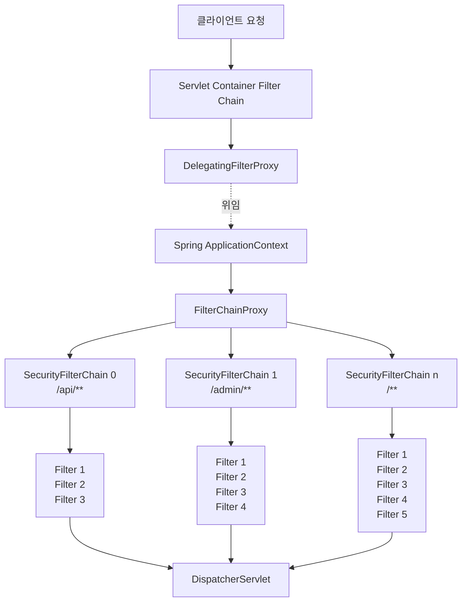
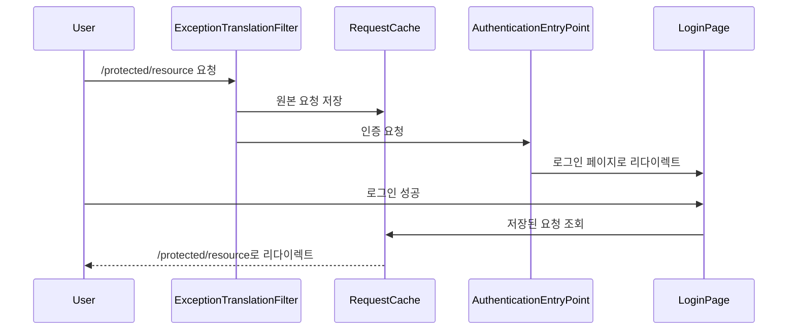

# Spring Security 아키텍처 이해하기

> 공식 문서 기반의 Spring Security 핵심 구조 분석

## 들어가며

Spring Security를 처음 접했을 때 가장 혼란스러웠던 부분은 "필터가 언제, 어떻게, 어떤 순서로 동작하는가"였다. 공식 문서를 여러 번 읽어도 DelegatingFilterProxy, FilterChainProxy, SecurityFilterChain의 차이가 명확하지 않았고, 커스텀 필터를 어디에 추가해야 할지 감이 잡히지 않았다.

이 글은 Spring Security 공식 문서의 Architecture 섹션을 기반으로 핵심 구조를 정리한 내용이다.

주요 니즈는 다음과 같았다:
- **전체 구조 이해**: DelegatingFilterProxy부터 개별 필터까지의 계층 구조
- **실행 흐름 파악**: 요청이 들어왔을 때 어떤 순서로 처리되는가
- **커스텀 필터 배치**: 내가 만든 필터를 어디에 추가해야 하는가
- **디버깅 방법**: 문제가 발생했을 때 어떻게 추적하는가

---

## 1. Spring Security의 계층 구조

### 전체 아키텍처 개요

Spring Security는 Servlet Filter 기반으로 동작한다. 하지만 단순히 필터 하나가 모든 일을 처리하는 것이 아니라, 여러 계층으로 구성된 정교한 구조를 가지고 있다.



### 계층별 역할

각 계층이 존재하는 이유를 이해하면 전체 구조가 명확해진다.

**Servlet Container Filter Chain**
- Servlet 표준 스펙의 필터 체인
- Spring과 무관하게 동작
- `web.xml` 또는 `@WebFilter`로 등록된 필터들이 여기에 포함됨

**DelegatingFilterProxy**
- Servlet Filter와 Spring Bean 사이의 다리 역할
- Servlet 컨테이너 생명주기와 Spring ApplicationContext 생명주기를 연결
- 실제 보안 로직은 수행하지 않고, Spring Bean에 위임만 함

**FilterChainProxy**
- Spring Security의 실제 진입점
- 여러 SecurityFilterChain 중 적절한 체인을 선택
- SecurityContext 정리, HttpFirewall 적용 등 부가 기능 제공

**SecurityFilterChain**
- URL 패턴별로 다른 필터 조합을 적용할 수 있게 함
- 첫 번째로 매칭되는 체인만 실행됨

---

## 2. DelegatingFilterProxy와 FilterChainProxy

### DelegatingFilterProxy의 역할

DelegatingFilterProxy는 Servlet 컨테이너와 Spring 컨텍스트 사이의 간극을 메운다.

```java
public class DelegatingFilterProxy extends GenericFilterBean {

    private String targetBeanName;

    @Override
    public void doFilter(ServletRequest request, ServletResponse response,
                        FilterChain filterChain) throws ServletException, IOException {

        // Spring ApplicationContext에서 실제 필터 Bean을 가져온다
        Filter delegate = getFilterBean(targetBeanName);

        // 실제 필터에 작업을 위임한다
        delegate.doFilter(request, response, filterChain);
    }
}
```

**왜 필요한가?**

Servlet 컨테이너는 자체 표준을 사용해서 필터를 등록한다. 하지만 Spring Security는 Spring Bean으로 관리되어야 한다. 이 둘을 연결하는 것이 DelegatingFilterProxy의 역할이다.

**지연 로딩의 이점**

Servlet 컨테이너는 필터를 먼저 등록하고, 나중에 Spring 컨텍스트가 초기화된다. DelegatingFilterProxy는 필터 Bean을 지연 로딩함으로써 이 순서 문제를 해결한다.

### FilterChainProxy의 역할

FilterChainProxy는 Spring Security의 핵심 컴포넌트다.

**주요 책임:**

1. **중앙화된 진입점**
   - 모든 Spring Security 기능의 시작점
   - 디버깅 시 이 지점에 중단점을 걸면 전체 흐름을 추적할 수 있다

2. **SecurityContext 정리**
   - 요청이 끝나면 SecurityContext를 정리해서 메모리 누수 방지
   - ThreadLocal을 사용하므로 이 과정이 필수다

3. **HttpFirewall 적용**
   - 특정 공격 유형으로부터 보호
   - 비정상적인 요청을 필터링

4. **유연한 SecurityFilterChain 선택**
   - URL뿐만 아니라 HttpServletRequest의 모든 요소를 기반으로 체인 선택
   - 헤더, 메서드, IP 등을 조건으로 사용 가능

```java
@Bean
public SecurityFilterChain apiFilterChain(HttpSecurity http) throws Exception {
    http
        .securityMatcher("/api/**")  // 이 패턴에만 적용
        .authorizeHttpRequests(auth -> auth
            .anyRequest().authenticated()
        )
        .httpBasic(Customizer.withDefaults());

    return http.build();
}

@Bean
public SecurityFilterChain adminFilterChain(HttpSecurity http) throws Exception {
    http
        .securityMatcher("/admin/**")  // 다른 패턴
        .authorizeHttpRequests(auth -> auth
            .anyRequest().hasRole("ADMIN")
        )
        .formLogin(Customizer.withDefaults());

    return http.build();
}
```

**SecurityFilterChain 선택 로직:**

- `/api/users` 요청 → apiFilterChain 실행
- `/admin/settings` 요청 → adminFilterChain 실행
- `/public/info` 요청 → 매칭되는 체인이 없으면 기본 체인 실행

**중요:** 첫 번째로 매칭되는 체인만 실행된다. 여러 체인이 매칭되어도 나머지는 무시된다.

---

## 3. SecurityFilterChain과 Security Filters

### SecurityFilterChain의 구성

하나의 SecurityFilterChain은 여러 개의 Security Filter로 구성된다.

```java
@Bean
public SecurityFilterChain filterChain(HttpSecurity http) throws Exception {
    http
        .csrf(csrf -> csrf.disable())                    // CsrfFilter 제거
        .httpBasic(Customizer.withDefaults())            // BasicAuthenticationFilter 추가
        .formLogin(Customizer.withDefaults())            // UsernamePasswordAuthenticationFilter 추가
        .authorizeHttpRequests(auth -> auth              // AuthorizationFilter 추가
            .requestMatchers("/public/**").permitAll()
            .anyRequest().authenticated()
        );

    return http.build();
}
```

위 설정은 다음과 같은 필터 체인을 생성한다:

```
SecurityContextHolderFilter
→ HeaderWriterFilter
→ LogoutFilter
→ BasicAuthenticationFilter
→ UsernamePasswordAuthenticationFilter
→ RequestCacheAwareFilter
→ SecurityContextHolderAwareRequestFilter
→ AnonymousAuthenticationFilter
→ SessionManagementFilter
→ ExceptionTranslationFilter
→ AuthorizationFilter
```

### 필터 실행 순서의 중요성

필터의 순서는 절대적이다. 잘못된 순서는 보안 취약점을 만든다.

**올바른 순서:**
```
인증 필터 → 인가 필터
```

**잘못된 순서:**
```
인가 필터 → 인증 필터
```

인가 필터가 먼저 실행되면, 인증되지 않은 사용자도 통과할 수 있다.

### 필터 순서 확인하기

Spring Security는 애플리케이션 시작 시 필터 목록을 로깅한다.

```properties
logging.level.org.springframework.security=DEBUG
```

**출력 예시:**

```
Will secure any request with [
  SecurityContextHolderFilter,
  HeaderWriterFilter,
  CsrfFilter,
  LogoutFilter,
  UsernamePasswordAuthenticationFilter,
  BasicAuthenticationFilter,
  RequestCacheAwareFilter,
  SecurityContextHolderAwareRequestFilter,
  AnonymousAuthenticationFilter,
  SessionManagementFilter,
  ExceptionTranslationFilter,
  AuthorizationFilter
]
```

TRACE 레벨로 설정하면 각 필터의 실행 과정도 추적할 수 있다.

```properties
logging.level.org.springframework.security=TRACE
```

---

## 4. 주요 Security Filters의 역할

### SecurityContextHolderFilter

**역할:** SecurityContext를 로드하고 저장한다.

```java
SecurityContext context = securityContextRepository.loadContext(request);
SecurityContextHolder.setContext(context);

try {
    chain.doFilter(request, response);
} finally {
    SecurityContextHolder.clearContext();
}
```

**핵심:**
- 세션에서 SecurityContext를 가져와 ThreadLocal에 설정
- 요청이 끝나면 정리
- 모든 필터 중 가장 먼저 실행되어야 함

### UsernamePasswordAuthenticationFilter

**역할:** 폼 로그인 요청을 처리한다.

```java
public Authentication attemptAuthentication(HttpServletRequest request,
                                           HttpServletResponse response) {
    String username = obtainUsername(request);
    String password = obtainPassword(request);

    UsernamePasswordAuthenticationToken authRequest =
        new UsernamePasswordAuthenticationToken(username, password);

    return this.getAuthenticationManager().authenticate(authRequest);
}
```

**동작 흐름:**
1. POST /login 요청 감지
2. username, password 추출
3. AuthenticationManager에 인증 위임
4. 성공 시 SecurityContext에 인증 정보 저장
5. 실패 시 AuthenticationFailureHandler 호출

### ExceptionTranslationFilter

**역할:** 인증/인가 예외를 처리한다.

```java
try {
    chain.doFilter(request, response);
} catch (AuthenticationException ex) {
    // 인증 실패 처리
    handleAuthenticationException(request, response, ex);
} catch (AccessDeniedException ex) {
    // 인가 실패 처리
    handleAccessDeniedException(request, response, ex);
}
```

**처리 방식:**

| 예외 타입 | 사용자 상태 | 처리 |
|----------|----------|------|
| AuthenticationException | 미인증 | AuthenticationEntryPoint 호출 (로그인 페이지 리다이렉트) |
| AccessDeniedException | 익명 사용자 | AuthenticationEntryPoint 호출 |
| AccessDeniedException | 인증된 사용자 | AccessDeniedHandler 호출 (403 Forbidden) |

### AuthorizationFilter

**역할:** 최종 인가 결정을 내린다.

```java
AuthorizationDecision decision =
    authorizationManager.check(authentication, request);

if (decision != null && !decision.isGranted()) {
    throw new AccessDeniedException("Access Denied");
}

chain.doFilter(request, response);
```

**핵심:**
- 모든 필터 중 가장 마지막에 실행
- 인증된 사용자의 권한을 검증
- 실패 시 AccessDeniedException 발생

---

## 5. 커스텀 필터 추가하기

### 필터 위치 결정 규칙

커스텀 필터를 추가할 때는 "이 필터가 무엇을 하는가"에 따라 위치가 결정된다.

**결정 트리:**

```
이 필터가 인증 정보를 필요로 하는가?
    ├─ 예: 인증 필터(UsernamePasswordAuthenticationFilter) 이후에 배치
    └─ 아니오: 인증 필터 이전에 배치

이 필터가 인증을 직접 수행하는가?
    ├─ 예: 인증 필터와 같은 위치에 배치
    └─ 아니오: 적절한 전후 위치에 배치
```

### 실전 예시: 테넌트 필터

멀티 테넌트 환경에서 사용자의 테넌트 접근 권한을 검증하는 필터다.

```java
public class TenantFilter extends OncePerRequestFilter {

    @Override
    protected void doFilterInternal(HttpServletRequest request,
                                    HttpServletResponse response,
                                    FilterChain filterChain) throws ServletException, IOException {

        // 1. 인증 정보 가져오기
        Authentication authentication = SecurityContextHolder.getContext().getAuthentication();

        if (authentication == null || !authentication.isAuthenticated()) {
            // 인증되지 않은 경우 다음 필터로 진행
            filterChain.doFilter(request, response);
            return;
        }

        // 2. 테넌트 ID 추출
        String tenantId = extractTenantId(request);

        // 3. 사용자가 해당 테넌트에 접근 권한이 있는지 확인
        if (!hasAccessToTenant(authentication, tenantId)) {
            throw new AccessDeniedException("테넌트 접근 권한이 없습니다");
        }

        // 4. 다음 필터로 진행
        filterChain.doFilter(request, response);
    }

    private String extractTenantId(HttpServletRequest request) {
        // X-Tenant-ID 헤더에서 추출
        return request.getHeader("X-Tenant-ID");
    }

    private boolean hasAccessToTenant(Authentication authentication, String tenantId) {
        // 사용자의 권한 목록에서 테넌트 권한 확인
        return authentication.getAuthorities().stream()
            .anyMatch(auth -> auth.getAuthority().equals("TENANT_" + tenantId));
    }
}
```

### 필터 등록

```java
@Bean
public SecurityFilterChain filterChain(HttpSecurity http) throws Exception {
    http
        .authorizeHttpRequests(auth -> auth
            .anyRequest().authenticated()
        )
        .addFilterAfter(new TenantFilter(), AnonymousAuthenticationFilter.class);

    return http.build();
}
```

**왜 AnonymousAuthenticationFilter 이후인가?**

1. 인증 정보가 필요하므로 인증 필터 이후여야 함
2. AnonymousAuthenticationFilter는 미인증 사용자에게 익명 인증을 부여함
3. 따라서 이 이후 시점에는 항상 Authentication 객체가 존재함

### 필터 배치 위치 가이드

| 필터 타입 | 배치 위치 | 이유 |
|----------|----------|------|
| Exploit Protection | SecurityContextHolderFilter 이후 | SecurityContext 로드 후 공격 방어 |
| 커스텀 인증 필터 | LogoutFilter 이후 | 로그아웃 처리 이후 인증 시도 |
| 추가 인가 필터 | AnonymousAuthenticationFilter 이후 | 익명 사용자 처리 완료 후 권한 검증 |

---

## 6. 실무 관점의 활용법

### 다중 SecurityFilterChain 구성

실무에서는 API와 웹 페이지를 함께 제공하는 경우가 많다. 이때 각각 다른 보안 정책을 적용해야 한다.

```java
@Configuration
@EnableWebSecurity
public class SecurityConfig {

    @Bean
    @Order(1)
    public SecurityFilterChain apiFilterChain(HttpSecurity http) throws Exception {
        http
            .securityMatcher("/api/**")
            .csrf(csrf -> csrf.disable())
            .sessionManagement(session -> session
                .sessionCreationPolicy(SessionCreationPolicy.STATELESS)
            )
            .authorizeHttpRequests(auth -> auth
                .requestMatchers("/api/public/**").permitAll()
                .anyRequest().authenticated()
            )
            .httpBasic(Customizer.withDefaults());

        return http.build();
    }

    @Bean
    @Order(2)
    public SecurityFilterChain webFilterChain(HttpSecurity http) throws Exception {
        http
            .securityMatcher("/**")
            .authorizeHttpRequests(auth -> auth
                .requestMatchers("/", "/home", "/public/**").permitAll()
                .anyRequest().authenticated()
            )
            .formLogin(form -> form
                .loginPage("/login")
                .permitAll()
            )
            .logout(logout -> logout
                .permitAll()
            );

        return http.build();
    }
}
```

**핵심 포인트:**
- `@Order`로 SecurityFilterChain의 우선순위 지정
- API는 Stateless + HTTP Basic
- 웹은 세션 기반 + 폼 로그인
- 각각 독립적인 보안 정책 적용

### RequestMatcher 활용

URL뿐만 아니라 다양한 조건으로 SecurityFilterChain을 선택할 수 있다.

```java
@Bean
public SecurityFilterChain mobileFilterChain(HttpSecurity http) throws Exception {
    http
        .securityMatcher(request -> {
            String userAgent = request.getHeader("User-Agent");
            return userAgent != null && userAgent.contains("Mobile");
        })
        .authorizeHttpRequests(auth -> auth
            .anyRequest().authenticated()
        );

    return http.build();
}
```

**활용 사례:**
- User-Agent 기반 분기
- IP 주소 기반 분기
- 특정 헤더 존재 여부
- HTTP 메서드별 분기

### FilterRegistrationBean으로 중복 등록 방지

Spring Bean으로 선언된 필터는 자동으로 Servlet Container에도 등록된다. 이를 방지하려면:

```java
@Bean
public FilterRegistrationBean<TenantFilter> tenantFilterRegistration(TenantFilter filter) {
    FilterRegistrationBean<TenantFilter> registration = new FilterRegistrationBean<>(filter);
    registration.setEnabled(false);  // Servlet Container 등록 비활성화
    return registration;
}
```

이렇게 하면 HttpSecurity를 통해서만 필터를 등록하고, Servlet Container의 기본 필터 체인에는 추가되지 않는다.

### 디버깅 전략

**1. 필터 실행 추적**

```java
@Component
@Order(Ordered.HIGHEST_PRECEDENCE)
public class FilterLoggingFilter extends OncePerRequestFilter {

    private static final Logger log = LoggerFactory.getLogger(FilterLoggingFilter.class);

    @Override
    protected void doFilterInternal(HttpServletRequest request,
                                    HttpServletResponse response,
                                    FilterChain filterChain) throws ServletException, IOException {

        log.info("=== Request Start: {} {} ===", request.getMethod(), request.getRequestURI());

        long startTime = System.currentTimeMillis();

        try {
            filterChain.doFilter(request, response);
        } finally {
            long duration = System.currentTimeMillis() - startTime;
            log.info("=== Request End: {} ms ===", duration);
        }
    }
}
```

**2. SecurityContext 상태 확인**

```java
Authentication auth = SecurityContextHolder.getContext().getAuthentication();
if (auth != null) {
    log.debug("Current user: {}", auth.getName());
    log.debug("Authorities: {}", auth.getAuthorities());
} else {
    log.debug("No authentication information");
}
```

**3. 필터 체인 출력**

```java
@Component
@RequiredArgsConstructor
public class FilterChainInspector {

    private final FilterChainProxy filterChainProxy;

    @PostConstruct
    public void printFilterChains() {
        List<SecurityFilterChain> filterChains = filterChainProxy.getFilterChains();

        for (int i = 0; i < filterChains.size(); i++) {
            SecurityFilterChain chain = filterChains.get(i);
            System.out.printf("=== SecurityFilterChain %d ===%n", i);

            List<Filter> filters = chain.getFilters();
            for (int j = 0; j < filters.size(); j++) {
                System.out.printf("  %d. %s%n", j + 1, filters.get(j).getClass().getSimpleName());
            }
        }
    }
}
```

---

## 7. ExceptionTranslationFilter와 예외 처리

### RequestCache의 역할

ExceptionTranslationFilter는 인증되지 않은 사용자의 요청을 RequestCache에 저장한다.



**기본 구현:**

```java
// 기본값: HttpSessionRequestCache
@Bean
public RequestCache requestCache() {
    return new HttpSessionRequestCache();
}
```

**REST API를 위한 변경:**

```java
@Bean
public SecurityFilterChain filterChain(HttpSecurity http) throws Exception {
    http
        .requestCache(cache -> cache
            .requestCache(new NullRequestCache())  // 요청 저장 비활성화
        );

    return http.build();
}
```

REST API는 Stateless하므로 요청을 저장할 필요가 없다.

### 커스텀 AuthenticationEntryPoint

인증 실패 시 JSON 응답을 반환하도록 커스터마이징할 수 있다.

```java
public class JsonAuthenticationEntryPoint implements AuthenticationEntryPoint {

    private final ObjectMapper objectMapper = new ObjectMapper();

    @Override
    public void commence(HttpServletRequest request,
                        HttpServletResponse response,
                        AuthenticationException authException) throws IOException {

        ErrorResponse error = ErrorResponse.builder()
            .status(HttpStatus.UNAUTHORIZED.value())
            .error("Unauthorized")
            .message("인증이 필요합니다")
            .path(request.getRequestURI())
            .timestamp(Instant.now())
            .build();

        response.setStatus(HttpStatus.UNAUTHORIZED.value());
        response.setContentType(MediaType.APPLICATION_JSON_VALUE);
        response.setCharacterEncoding(StandardCharsets.UTF_8.name());

        response.getWriter().write(objectMapper.writeValueAsString(error));
    }
}
```

등록:

```java
@Bean
public SecurityFilterChain filterChain(HttpSecurity http) throws Exception {
    http
        .exceptionHandling(exception -> exception
            .authenticationEntryPoint(new JsonAuthenticationEntryPoint())
        );

    return http.build();
}
```

---

## 8. 핵심 원칙 정리

### 계층 구조
DelegatingFilterProxy → FilterChainProxy → SecurityFilterChain → Security Filters 순서로 계층이 구성된다. 각 계층은 명확한 책임을 가진다.

### 필터 순서
필터의 실행 순서는 보안에 직접적인 영향을 미친다. 인증이 인가보다 먼저, 예외 처리가 인가 직전에 위치해야 한다.

### SecurityFilterChain 선택
첫 번째로 매칭되는 SecurityFilterChain만 실행된다. `@Order`로 우선순위를 명확히 지정해야 한다.

### SecurityContext 생명주기
SecurityContext는 요청마다 생성되고 소멸된다. ThreadLocal을 사용하므로 요청 종료 시 반드시 정리해야 한다.

### 커스텀 필터 배치
필터의 역할에 따라 적절한 위치에 배치한다. 인증 필터 전/후, 인가 필터 전/후를 명확히 구분한다.

### 디버깅
DEBUG/TRACE 로깅을 활용하면 필터 실행 순서와 예외 발생 지점을 정확히 파악할 수 있다.

---

## 마치며

Spring Security의 아키텍처는 복잡해 보이지만, 각 컴포넌트의 역할을 이해하면 논리적이고 확장 가능한 구조임을 알 수 있다.

공식 문서를 여러 번 읽으면서 느낀 점은 **모든 설계에는 이유가 있다**는 것이다. DelegatingFilterProxy가 왜 필요한지, FilterChainProxy가 왜 존재하는지, 필터 순서가 왜 중요한지를 이해하면 커스텀 보안 로직을 구현할 때 올바른 판단을 내릴 수 있다.

처음에는 "왜 이렇게 복잡하게 만들었을까"라는 생각이 들었지만, 이제는 이 구조가 확장성, 유연성, 안정성을 모두 고려한 결과임을 이해한다. 필터 체인의 각 단계를 이해하고 나니, 이전에는 막막했던 보안 요구사항도 자연스럽게 구현할 수 있게 되었다.

중요한 건 **왜 이런 구조인가**를 이해하는 것이다. 단순히 설정을 복사하기보다는, 각 컴포넌트가 어떤 역할을 하는지 파악하면 훨씬 안정적이고 유지보수하기 쉬운 보안 로직을 만들 수 있다.

---

## 참고자료

- [Spring Security Reference - Servlet Architecture](https://docs.spring.io/spring-security/reference/servlet/architecture.html)
- [Spring Security Reference - Security Filters](https://docs.spring.io/spring-security/reference/servlet/architecture.html#servlet-security-filters)
- [Spring Security GitHub - FilterChainProxy](https://github.com/spring-projects/spring-security/blob/main/web/src/main/java/org/springframework/security/web/FilterChainProxy.java)
- [Spring Security GitHub - DelegatingFilterProxy](https://github.com/spring-projects/spring-security/blob/main/web/src/main/java/org/springframework/web/filter/DelegatingFilterProxy.java)
