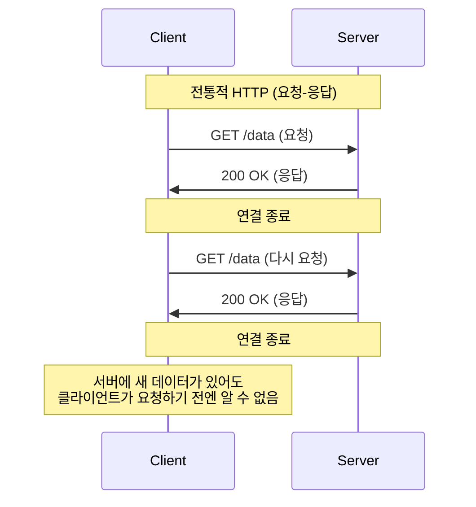
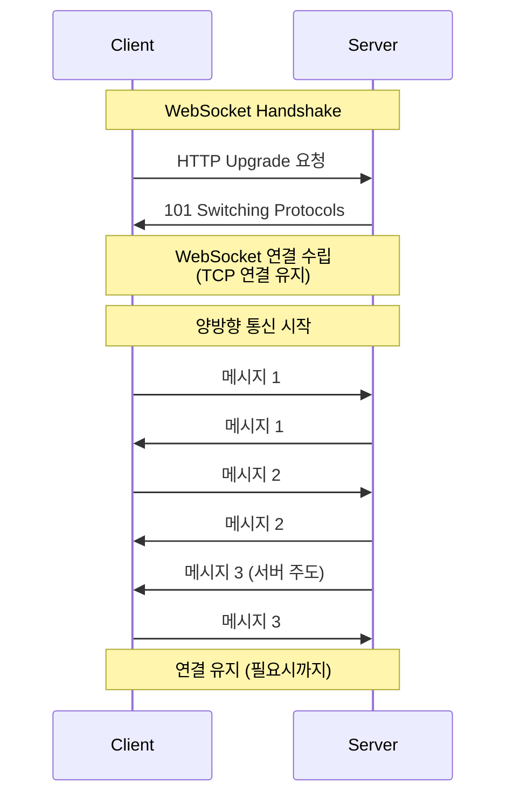
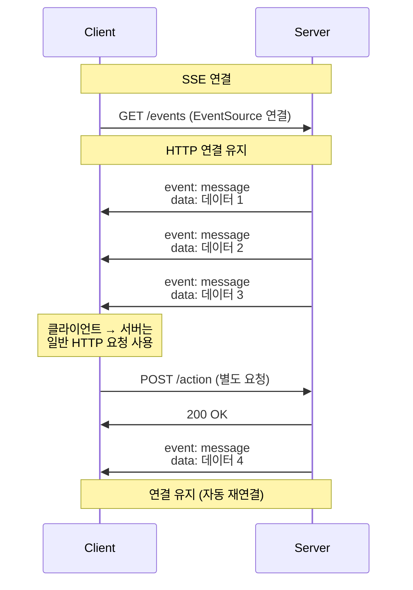
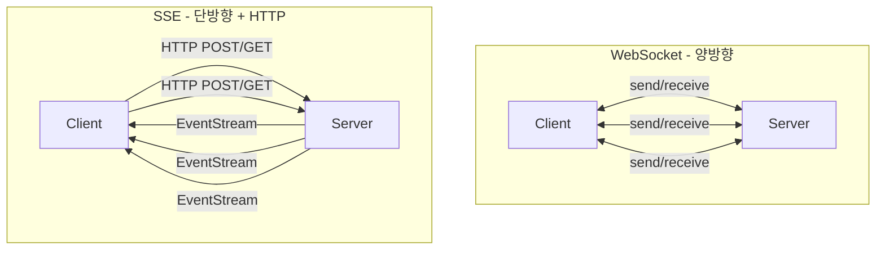
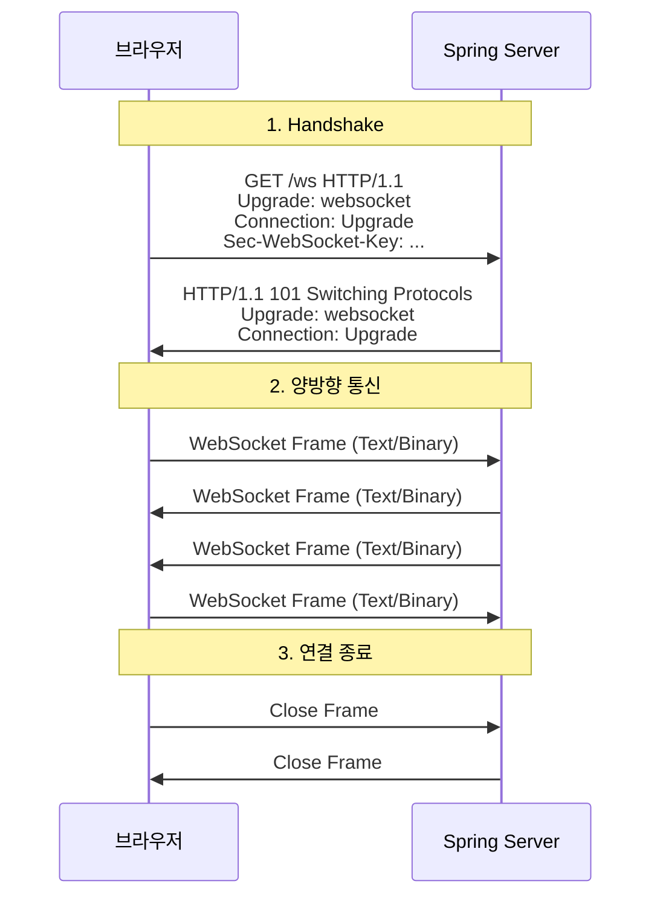
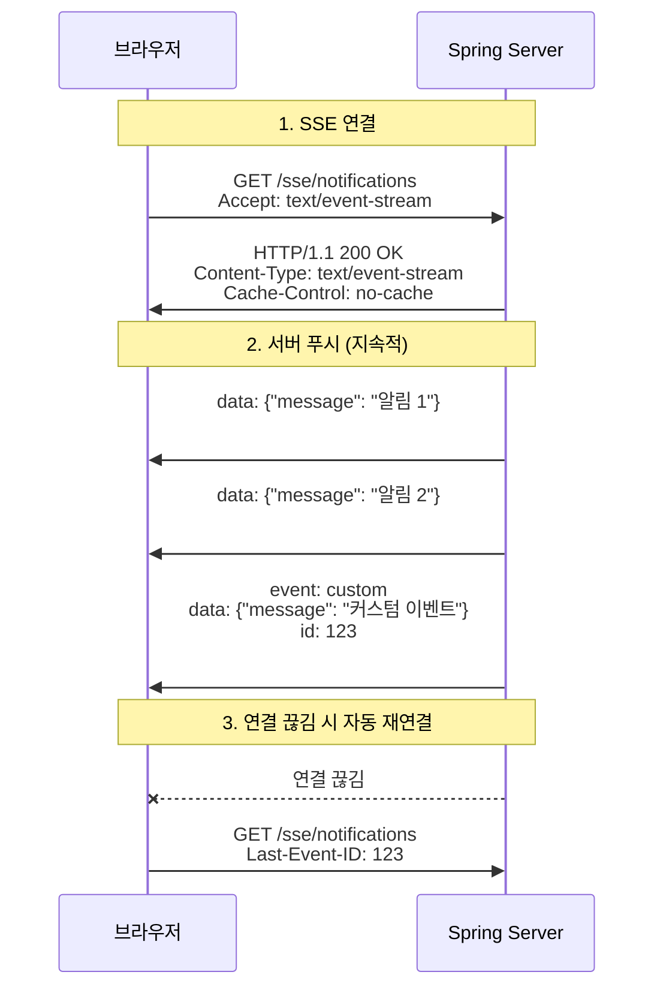

# WebSocket과 SSE

> 실시간 양방향 통신 vs 서버 푸시: 언제 무엇을 선택할 것인가

## 들어가며

전통적인 HTTP는 요청-응답 모델이다. 클라이언트가 요청하면 서버가 응답한다. 하지만 실시간 알림, 채팅, 주식 시세처럼 서버에서 클라이언트로 데이터를 **능동적으로 보내야** 하는 경우가 있다.

이 문제를 해결하는 두 가지 주요 기술이 **WebSocket**과 **SSE(Server-Sent Events)**다.

이 문서는 내가 실시간 통신을 구현하면서 고민한 내용을 정리한 것이다. 주요 질문은:

- **WebSocket**과 **SSE**는 각각 언제 사용해야 하는가?
- 양방향 통신이 정말 필요한가, 아니면 서버 푸시만 필요한가?
- 어떻게 구현하고 연결을 관리하는가?
- 인프라 관점에서 어떤 차이가 있는가?

---

## 1. HTTP의 한계와 해결책

### 전통적인 HTTP의 문제



**문제점**:
1. **Polling**: 주기적으로 요청해야 함 (비효율적)
2. **서버 푸시 불가**: 서버가 능동적으로 데이터 전송 불가
3. **연결 오버헤드**: 매번 TCP 연결 생성/해제
4. **실시간성 부족**: 폴링 주기만큼 지연 발생

### Polling의 비효율성

```javascript
// Bad: 1초마다 서버에 요청
setInterval(() => {
    fetch('/api/notifications')
        .then(res => res.json())
        .then(data => updateUI(data));
}, 1000);

// 문제:
// - 새 데이터가 없어도 계속 요청
// - 1초마다 HTTP 연결 생성/해제
// - 서버/네트워크 부하 증가
```

### Long Polling의 한계

```javascript
// Long Polling: 서버가 응답할 때까지 대기
function longPoll() {
    fetch('/api/notifications')
        .then(res => res.json())
        .then(data => {
            updateUI(data);
            longPoll();  // 다시 요청
        });
}

// 문제:
// - 여전히 HTTP 오버헤드
// - 연결 타임아웃 처리 복잡
// - 양방향 통신 불가
```

**해결책**: WebSocket과 SSE

---

## 2. WebSocket과 SSE 개요

### WebSocket

**완전한 양방향(Full-Duplex) 통신**



**특징**:
- HTTP로 핸드셰이크 후 WebSocket 프로토콜로 업그레이드
- 지속적인 TCP 연결 유지
- 클라이언트 ↔ 서버 양방향 통신
- 낮은 오버헤드 (헤더가 작음)
- 바이너리/텍스트 데이터 모두 전송 가능

### SSE (Server-Sent Events)

**서버에서 클라이언트로 단방향(Unidirectional) 푸시**



**특징**:
- HTTP 기반 (별도 프로토콜 업그레이드 없음)
- 서버 → 클라이언트 단방향 통신
- 텍스트 데이터만 전송 (UTF-8)
- 자동 재연결 기능 내장
- EventSource API로 간단하게 사용

---

## 3. WebSocket vs SSE 비교

### 핵심 차이점

| 특성 | WebSocket | SSE |
|-----|-----------|-----|
| **통신 방향** | 양방향 (Full-Duplex) | 단방향 (Server → Client) |
| **프로토콜** | ws:// 또는 wss:// | HTTP/HTTPS |
| **데이터 타입** | 텍스트 + 바이너리 | 텍스트만 (UTF-8) |
| **브라우저 지원** | 거의 모든 브라우저 | IE 제외 모든 브라우저 |
| **재연결** | 수동 구현 필요 | 자동 재연결 내장 |
| **메시지 포맷** | 자유 (JSON, Protocol Buffers 등) | event-stream 포맷 고정 |
| **HTTP 호환성** | 핸드셰이크 후 업그레이드 | 표준 HTTP |
| **프록시/방화벽** | 차단될 수 있음 | HTTP이므로 통과 용이 |
| **연결 수 제한** | 서버 리소스에 따라 | 브라우저당 6개 (HTTP/1.1) |
| **복잡도** | 높음 (연결 관리 필요) | 낮음 (브라우저가 처리) |

### 통신 패턴 비교



### 언제 무엇을 선택할 것인가?

#### WebSocket을 사용해야 하는 경우

✅ **실시간 채팅**
```
- 클라이언트와 서버 간 빈번한 메시지 교환
- 양방향 통신 필수
```

✅ **멀티플레이어 게임**
```
- 낮은 지연시간 요구
- 클라이언트 입력 → 서버 → 다른 클라이언트로 즉시 전파
```

✅ **협업 도구 (Google Docs)**
```
- 여러 사용자의 실시간 동시 편집
- 양방향 동기화
```

✅ **바이너리 데이터 전송**
```
- 이미지, 파일, 스트리밍 데이터
```

#### SSE를 사용해야 하는 경우

✅ **실시간 알림**
```
- 서버에서 클라이언트로만 푸시
- 클라이언트는 읽기만 함
```

✅ **뉴스 피드/소셜 미디어 업데이트**
```
- 새 게시물, 좋아요 알림 등
- 서버 주도 푸시
```

✅ **주식 시세/스포츠 스코어**
```
- 실시간 데이터 스트리밍
- 클라이언트는 구독만
```

✅ **서버 로그 모니터링**
```
- 서버 상태를 실시간으로 전송
- 클라이언트는 표시만
```

✅ **프로그레스 바 업데이트**
```
- 파일 업로드, 작업 진행률
- 서버에서 진행 상황 푸시
```

**원칙**: 양방향 통신이 필요하면 WebSocket, 서버 푸시만 필요하면 SSE

---

## 4. WebSocket 구현

### 동작 원리



### Spring Boot 구현

#### 1. 의존성 추가

```gradle
dependencies {
    implementation 'org.springframework.boot:spring-boot-starter-websocket'
}
```

#### 2. WebSocket 설정

```java
@Configuration
@EnableWebSocket
public class WebSocketConfig implements WebSocketConfigurer {

    private final ChatWebSocketHandler chatWebSocketHandler;

    public WebSocketConfig(ChatWebSocketHandler chatWebSocketHandler) {
        this.chatWebSocketHandler = chatWebSocketHandler;
    }

    @Override
    public void registerWebSocketHandlers(WebSocketHandlerRegistry registry) {
        registry.addHandler(chatWebSocketHandler, "/ws/chat")
                .setAllowedOrigins("*");  // CORS 설정 (프로덕션에선 구체적으로)
    }
}
```

#### 3. WebSocket Handler 구현

```java
@Component
public class ChatWebSocketHandler extends TextWebSocketHandler {

    // 연결된 세션 관리
    private final Set<WebSocketSession> sessions = ConcurrentHashMap.newKeySet();

    @Override
    public void afterConnectionEstablished(WebSocketSession session) throws Exception {
        sessions.add(session);
        System.out.println("새 연결: " + session.getId());

        // 연결 환영 메시지
        session.sendMessage(new TextMessage("연결되었습니다!"));
    }

    @Override
    protected void handleTextMessage(WebSocketSession session, TextMessage message) throws Exception {
        String payload = message.getPayload();
        System.out.println("받은 메시지: " + payload);

        // JSON 파싱 (실제로는 ObjectMapper 사용)
        ChatMessage chatMessage = parseChatMessage(payload);

        // 모든 클라이언트에게 브로드캐스트
        broadcast(chatMessage);
    }

    @Override
    public void afterConnectionClosed(WebSocketSession session, CloseStatus status) throws Exception {
        sessions.remove(session);
        System.out.println("연결 종료: " + session.getId());
    }

    @Override
    public void handleTransportError(WebSocketSession session, Throwable exception) throws Exception {
        System.err.println("에러 발생: " + exception.getMessage());
        session.close();
    }

    // 모든 세션에 메시지 전송
    private void broadcast(ChatMessage message) {
        String json = convertToJson(message);
        TextMessage textMessage = new TextMessage(json);

        sessions.forEach(session -> {
            try {
                if (session.isOpen()) {
                    session.sendMessage(textMessage);
                }
            } catch (IOException e) {
                System.err.println("메시지 전송 실패: " + e.getMessage());
            }
        });
    }

    // 특정 세션에만 전송
    public void sendToSession(String sessionId, ChatMessage message) {
        sessions.stream()
                .filter(session -> session.getId().equals(sessionId))
                .findFirst()
                .ifPresent(session -> {
                    try {
                        session.sendMessage(new TextMessage(convertToJson(message)));
                    } catch (IOException e) {
                        System.err.println("메시지 전송 실패: " + e.getMessage());
                    }
                });
    }

    private ChatMessage parseChatMessage(String json) {
        // JSON 파싱 로직 (ObjectMapper 사용)
        return new ChatMessage("user", json, Instant.now());
    }

    private String convertToJson(ChatMessage message) {
        // JSON 변환 로직 (ObjectMapper 사용)
        return String.format(
            "{\"username\":\"%s\",\"message\":\"%s\",\"timestamp\":\"%s\"}",
            message.username(), message.message(), message.timestamp()
        );
    }
}

record ChatMessage(String username, String message, Instant timestamp) {}
```

#### 4. STOMP 사용 (권장)

WebSocket 위에 STOMP 프로토콜을 사용하면 더 구조화된 메시징이 가능하다.

```java
@Configuration
@EnableWebSocketMessageBroker
public class WebSocketStompConfig implements WebSocketMessageBrokerConfigurer {

    @Override
    public void configureMessageBroker(MessageBrokerRegistry config) {
        // 클라이언트로 메시지를 보낼 때 사용할 prefix
        config.enableSimpleBroker("/topic", "/queue");

        // 클라이언트에서 서버로 메시지를 보낼 때 사용할 prefix
        config.setApplicationDestinationPrefixes("/app");
    }

    @Override
    public void registerStompEndpoints(StompEndpointRegistry registry) {
        registry.addEndpoint("/ws")
                .setAllowedOrigins("*")
                .withSockJS();  // SockJS fallback
    }
}
```

```java
@Controller
public class ChatController {

    @MessageMapping("/chat.send")  // /app/chat.send로 메시지 받음
    @SendTo("/topic/chat")           // /topic/chat 구독자에게 전송
    public ChatMessage sendMessage(ChatMessage message) {
        return new ChatMessage(
            message.username(),
            message.message(),
            Instant.now()
        );
    }

    @MessageMapping("/chat.private")  // 특정 사용자에게만 전송
    public void sendPrivateMessage(
        @Payload ChatMessage message,
        @Header("simpSessionId") String sessionId
    ) {
        messagingTemplate.convertAndSendToUser(
            sessionId,
            "/queue/private",
            message
        );
    }
}
```

### React 클라이언트 구현

#### 1. 기본 WebSocket API

```typescript
import { useEffect, useState, useRef } from 'react';

interface ChatMessage {
  username: string;
  message: string;
  timestamp: string;
}

function ChatComponent() {
  const [messages, setMessages] = useState<ChatMessage[]>([]);
  const [inputMessage, setInputMessage] = useState('');
  const [isConnected, setIsConnected] = useState(false);
  const wsRef = useRef<WebSocket | null>(null);

  useEffect(() => {
    // WebSocket 연결
    const ws = new WebSocket('ws://localhost:8080/ws/chat');
    wsRef.current = ws;

    ws.onopen = () => {
      console.log('WebSocket 연결됨');
      setIsConnected(true);
    };

    ws.onmessage = (event) => {
      const message: ChatMessage = JSON.parse(event.data);
      setMessages((prev) => [...prev, message]);
    };

    ws.onerror = (error) => {
      console.error('WebSocket 에러:', error);
    };

    ws.onclose = () => {
      console.log('WebSocket 연결 종료');
      setIsConnected(false);
    };

    // 컴포넌트 언마운트 시 연결 종료
    return () => {
      ws.close();
    };
  }, []);

  const sendMessage = () => {
    if (wsRef.current && wsRef.current.readyState === WebSocket.OPEN) {
      const message: ChatMessage = {
        username: 'User',
        message: inputMessage,
        timestamp: new Date().toISOString(),
      };

      wsRef.current.send(JSON.stringify(message));
      setInputMessage('');
    }
  };

  return (
    <div>
      <div>
        <span>상태: {isConnected ? '연결됨' : '연결 안 됨'}</span>
      </div>

      <div style={{ height: '400px', overflowY: 'auto', border: '1px solid #ccc' }}>
        {messages.map((msg, index) => (
          <div key={index}>
            <strong>{msg.username}</strong>: {msg.message}
            <small> ({new Date(msg.timestamp).toLocaleTimeString()})</small>
          </div>
        ))}
      </div>

      <div>
        <input
          type="text"
          value={inputMessage}
          onChange={(e) => setInputMessage(e.target.value)}
          onKeyPress={(e) => e.key === 'Enter' && sendMessage()}
          disabled={!isConnected}
        />
        <button onClick={sendMessage} disabled={!isConnected}>
          전송
        </button>
      </div>
    </div>
  );
}

export default ChatComponent;
```

#### 2. 재연결 로직 추가

```typescript
function useWebSocket(url: string) {
  const [isConnected, setIsConnected] = useState(false);
  const wsRef = useRef<WebSocket | null>(null);
  const reconnectTimeoutRef = useRef<NodeJS.Timeout | null>(null);
  const reconnectAttemptsRef = useRef(0);

  const connect = useCallback(() => {
    const ws = new WebSocket(url);
    wsRef.current = ws;

    ws.onopen = () => {
      console.log('WebSocket 연결됨');
      setIsConnected(true);
      reconnectAttemptsRef.current = 0;  // 재연결 카운트 초기화
    };

    ws.onclose = () => {
      console.log('WebSocket 연결 종료');
      setIsConnected(false);

      // 자동 재연결 (최대 5회)
      if (reconnectAttemptsRef.current < 5) {
        const delay = Math.min(1000 * Math.pow(2, reconnectAttemptsRef.current), 10000);
        console.log(`${delay}ms 후 재연결 시도...`);

        reconnectTimeoutRef.current = setTimeout(() => {
          reconnectAttemptsRef.current += 1;
          connect();
        }, delay);
      } else {
        console.error('재연결 실패: 최대 시도 횟수 초과');
      }
    };

    ws.onerror = (error) => {
      console.error('WebSocket 에러:', error);
    };

    return ws;
  }, [url]);

  useEffect(() => {
    const ws = connect();

    return () => {
      if (reconnectTimeoutRef.current) {
        clearTimeout(reconnectTimeoutRef.current);
      }
      ws.close();
    };
  }, [connect]);

  return { ws: wsRef.current, isConnected };
}
```

#### 3. SockJS + STOMP 사용 (권장)

```bash
npm install sockjs-client @stomp/stompjs
```

```typescript
import { useEffect, useState, useRef } from 'react';
import SockJS from 'sockjs-client';
import { Client, IMessage } from '@stomp/stompjs';

function ChatWithStomp() {
  const [messages, setMessages] = useState<ChatMessage[]>([]);
  const [isConnected, setIsConnected] = useState(false);
  const clientRef = useRef<Client | null>(null);

  useEffect(() => {
    // STOMP 클라이언트 생성
    const client = new Client({
      webSocketFactory: () => new SockJS('http://localhost:8080/ws'),

      onConnect: () => {
        console.log('STOMP 연결됨');
        setIsConnected(true);

        // /topic/chat 구독
        client.subscribe('/topic/chat', (message: IMessage) => {
          const chatMessage: ChatMessage = JSON.parse(message.body);
          setMessages((prev) => [...prev, chatMessage]);
        });

        // 개인 메시지 구독
        client.subscribe('/user/queue/private', (message: IMessage) => {
          const chatMessage: ChatMessage = JSON.parse(message.body);
          console.log('개인 메시지:', chatMessage);
        });
      },

      onDisconnect: () => {
        console.log('STOMP 연결 종료');
        setIsConnected(false);
      },

      onStompError: (frame) => {
        console.error('STOMP 에러:', frame);
      },

      // 자동 재연결 설정
      reconnectDelay: 5000,
      heartbeatIncoming: 4000,
      heartbeatOutgoing: 4000,
    });

    clientRef.current = client;
    client.activate();

    return () => {
      client.deactivate();
    };
  }, []);

  const sendMessage = (message: string) => {
    if (clientRef.current && isConnected) {
      clientRef.current.publish({
        destination: '/app/chat.send',
        body: JSON.stringify({
          username: 'User',
          message: message,
        }),
      });
    }
  };

  return (
    <div>
      {/* UI 동일 */}
    </div>
  );
}
```

---

## 5. SSE 구현

### 동작 원리



### Spring Boot 구현

#### 1. SSE Controller

```java
@RestController
@RequestMapping("/sse")
public class SseController {

    // 연결된 클라이언트 관리
    private final Map<String, SseEmitter> emitters = new ConcurrentHashMap<>();

    @GetMapping(value = "/notifications", produces = MediaType.TEXT_EVENT_STREAM_VALUE)
    public SseEmitter streamNotifications(
        @RequestHeader(value = "Last-Event-ID", required = false) String lastEventId
    ) {
        String clientId = UUID.randomUUID().toString();

        // SseEmitter 생성 (타임아웃 30분)
        SseEmitter emitter = new SseEmitter(30 * 60 * 1000L);
        emitters.put(clientId, emitter);

        // 연결 완료 시
        emitter.onCompletion(() -> {
            System.out.println("SSE 연결 완료: " + clientId);
            emitters.remove(clientId);
        });

        // 타임아웃 시
        emitter.onTimeout(() -> {
            System.out.println("SSE 타임아웃: " + clientId);
            emitters.remove(clientId);
        });

        // 에러 발생 시
        emitter.onError((ex) -> {
            System.err.println("SSE 에러: " + ex.getMessage());
            emitters.remove(clientId);
        });

        // 연결 직후 초기 메시지 전송
        try {
            emitter.send(SseEmitter.event()
                .name("connected")
                .data("연결되었습니다! Client ID: " + clientId));

            // Last-Event-ID가 있으면 이후 이벤트 재전송 (재연결 시)
            if (lastEventId != null) {
                sendMissedEvents(emitter, lastEventId);
            }
        } catch (IOException e) {
            emitter.completeWithError(e);
        }

        return emitter;
    }

    // 모든 클라이언트에게 알림 전송
    public void sendNotificationToAll(Notification notification) {
        List<String> deadEmitters = new ArrayList<>();

        emitters.forEach((clientId, emitter) -> {
            try {
                emitter.send(SseEmitter.event()
                    .id(notification.getId().toString())
                    .name("notification")
                    .data(notification));
            } catch (IOException e) {
                deadEmitters.add(clientId);
            }
        });

        // 실패한 연결 제거
        deadEmitters.forEach(emitters::remove);
    }

    // 특정 사용자에게만 전송
    public void sendNotificationToUser(String userId, Notification notification) {
        // userId로 emitter 찾아서 전송 (실제로는 userId-emitter 매핑 필요)
        emitters.values().forEach(emitter -> {
            try {
                emitter.send(SseEmitter.event()
                    .name("notification")
                    .data(notification));
            } catch (IOException e) {
                // 에러 처리
            }
        });
    }

    // 하트비트 (연결 유지)
    @Scheduled(fixedRate = 15000)  // 15초마다
    public void sendHeartbeat() {
        List<String> deadEmitters = new ArrayList<>();

        emitters.forEach((clientId, emitter) -> {
            try {
                emitter.send(SseEmitter.event()
                    .name("heartbeat")
                    .data(""));
            } catch (IOException e) {
                deadEmitters.add(clientId);
            }
        });

        deadEmitters.forEach(emitters::remove);
    }

    private void sendMissedEvents(SseEmitter emitter, String lastEventId) {
        // 재연결 시 놓친 이벤트 재전송 로직
        // 실제로는 이벤트 저장소에서 조회
    }
}

record Notification(Long id, String message, String type, Instant timestamp) {}
```

#### 2. 알림 발행 서비스

```java
@Service
public class NotificationService {

    private final SseController sseController;

    public NotificationService(SseController sseController) {
        this.sseController = sseController;
    }

    public void publishNotification(String message, String type) {
        Notification notification = new Notification(
            generateId(),
            message,
            type,
            Instant.now()
        );

        sseController.sendNotificationToAll(notification);
    }

    // 다른 서비스에서 호출
    public void notifyNewComment(Long postId) {
        publishNotification(
            "새로운 댓글이 달렸습니다: " + postId,
            "COMMENT"
        );
    }

    public void notifyLike(Long postId) {
        publishNotification(
            "좋아요를 받았습니다: " + postId,
            "LIKE"
        );
    }

    private Long generateId() {
        return System.currentTimeMillis();
    }
}
```

### React 클라이언트 구현

#### 1. 기본 EventSource API

```typescript
import { useEffect, useState } from 'react';

interface Notification {
  id: number;
  message: string;
  type: string;
  timestamp: string;
}

function NotificationComponent() {
  const [notifications, setNotifications] = useState<Notification[]>([]);
  const [isConnected, setIsConnected] = useState(false);

  useEffect(() => {
    // EventSource 생성
    const eventSource = new EventSource('http://localhost:8080/sse/notifications');

    eventSource.onopen = () => {
      console.log('SSE 연결됨');
      setIsConnected(true);
    };

    // 기본 이벤트 리스너 (event 타입이 지정되지 않은 경우)
    eventSource.onmessage = (event) => {
      console.log('메시지:', event.data);
    };

    // 'connected' 이벤트 리스너
    eventSource.addEventListener('connected', (event) => {
      console.log('연결 메시지:', event.data);
    });

    // 'notification' 이벤트 리스너
    eventSource.addEventListener('notification', (event) => {
      const notification: Notification = JSON.parse(event.data);
      setNotifications((prev) => [notification, ...prev]);

      // 브라우저 알림 (권한 필요)
      if (Notification.permission === 'granted') {
        new Notification(notification.type, {
          body: notification.message,
        });
      }
    });

    // 하트비트 무시
    eventSource.addEventListener('heartbeat', () => {
      console.log('♥');
    });

    // 에러 처리
    eventSource.onerror = (error) => {
      console.error('SSE 에러:', error);

      if (eventSource.readyState === EventSource.CLOSED) {
        console.log('SSE 연결 종료');
        setIsConnected(false);
      }
      // EventSource는 자동으로 재연결 시도
    };

    // 컴포넌트 언마운트 시 연결 종료
    return () => {
      eventSource.close();
    };
  }, []);

  // 브라우저 알림 권한 요청
  useEffect(() => {
    if (Notification.permission === 'default') {
      Notification.requestPermission();
    }
  }, []);

  return (
    <div>
      <div>
        <span>상태: {isConnected ? '연결됨' : '연결 안 됨'}</span>
      </div>

      <div>
        <h3>알림 목록</h3>
        {notifications.length === 0 && <p>알림이 없습니다.</p>}
        {notifications.map((notification) => (
          <div
            key={notification.id}
            style={{
              padding: '10px',
              margin: '5px 0',
              border: '1px solid #ddd',
              borderRadius: '5px',
            }}
          >
            <strong>[{notification.type}]</strong> {notification.message}
            <br />
            <small>{new Date(notification.timestamp).toLocaleString()}</small>
          </div>
        ))}
      </div>
    </div>
  );
}

export default NotificationComponent;
```

#### 2. Custom Hook으로 재사용

```typescript
import { useEffect, useState, useRef, useCallback } from 'react';

interface UseSSEOptions {
  onMessage?: (data: any) => void;
  onError?: (error: Event) => void;
  onOpen?: () => void;
  eventListeners?: {
    [eventName: string]: (event: MessageEvent) => void;
  };
}

function useSSE(url: string, options?: UseSSEOptions) {
  const [isConnected, setIsConnected] = useState(false);
  const eventSourceRef = useRef<EventSource | null>(null);

  useEffect(() => {
    const eventSource = new EventSource(url);
    eventSourceRef.current = eventSource;

    eventSource.onopen = () => {
      console.log('SSE 연결됨');
      setIsConnected(true);
      options?.onOpen?.();
    };

    eventSource.onmessage = (event) => {
      try {
        const data = JSON.parse(event.data);
        options?.onMessage?.(data);
      } catch {
        options?.onMessage?.(event.data);
      }
    };

    eventSource.onerror = (error) => {
      console.error('SSE 에러:', error);
      setIsConnected(false);
      options?.onError?.(error);
    };

    // 커스텀 이벤트 리스너 등록
    if (options?.eventListeners) {
      Object.entries(options.eventListeners).forEach(([eventName, handler]) => {
        eventSource.addEventListener(eventName, handler);
      });
    }

    return () => {
      eventSource.close();
    };
  }, [url]);

  const close = useCallback(() => {
    eventSourceRef.current?.close();
  }, []);

  return { isConnected, close };
}

// 사용 예시
function NotificationWithHook() {
  const [notifications, setNotifications] = useState<Notification[]>([]);

  useSSE('http://localhost:8080/sse/notifications', {
    onOpen: () => console.log('연결 완료!'),
    eventListeners: {
      notification: (event) => {
        const notification = JSON.parse(event.data);
        setNotifications((prev) => [notification, ...prev]);
      },
      connected: (event) => {
        console.log('초기 메시지:', event.data);
      },
    },
  });

  return (
    <div>
      {/* UI */}
    </div>
  );
}
```

---

## 6. 인프라 및 스케일링 고려사항

### WebSocket

#### 장점
- **낮은 오버헤드**: 헤더가 작아 네트워크 효율적
- **낮은 지연시간**: 메시지 즉시 전송
- **양방향 통신**: 클라이언트-서버 모두 능동적

#### 단점/주의사항
- **프록시/로드밸런서 설정 필요**
  ```nginx
  # Nginx 예시
  location /ws {
      proxy_pass http://backend;
      proxy_http_version 1.1;
      proxy_set_header Upgrade $http_upgrade;
      proxy_set_header Connection "upgrade";
      proxy_read_timeout 86400;  # 24시간
  }
  ```

- **세션 고정 (Sticky Session) 필요**
  - 로드밸런서에서 같은 서버로 라우팅
  - 또는 Redis Pub/Sub으로 서버 간 메시지 브로드캐스트

- **연결 수 제한**
  - 서버당 수만 개 연결 유지 가능
  - C10K 문제 고려

- **방화벽 이슈**
  - 일부 기업 방화벽이 WebSocket 차단
  - SockJS fallback 사용 권장

### SSE

#### 장점
- **HTTP 기반**: 프록시/방화벽 통과 용이
- **자동 재연결**: 브라우저가 처리
- **구현 간단**: EventSource API 사용

#### 단점/주의사항
- **브라우저 연결 제한**
  ```
  HTTP/1.1: 도메인당 6개 연결
  HTTP/2: 제한 없음 (multiplexing)
  ```

  해결책:
  - HTTP/2 사용
  - 서브도메인 분산 (events1.example.com, events2.example.com)

- **단방향 통신**
  - 클라이언트 → 서버는 별도 HTTP 요청 필요
  - 양방향이 필요하면 WebSocket 고려

- **텍스트만 지원**
  - 바이너리 데이터는 Base64 인코딩 필요 (비효율)

### 스케일링 전략

#### Redis Pub/Sub (WebSocket)

```java
@Configuration
public class RedisConfig {

    @Bean
    public RedisMessageListenerContainer redisMessageListenerContainer(
        RedisConnectionFactory connectionFactory,
        MessageListener messageListener
    ) {
        RedisMessageListenerContainer container = new RedisMessageListenerContainer();
        container.setConnectionFactory(connectionFactory);
        container.addMessageListener(messageListener, new PatternTopic("chat.*"));
        return container;
    }
}

@Service
public class ChatMessagePublisher {

    private final RedisTemplate<String, ChatMessage> redisTemplate;

    public void publish(String channel, ChatMessage message) {
        redisTemplate.convertAndSend("chat." + channel, message);
    }
}

@Service
public class ChatMessageSubscriber implements MessageListener {

    private final ChatWebSocketHandler handler;

    @Override
    public void onMessage(Message message, byte[] pattern) {
        ChatMessage chatMessage = deserialize(message.getBody());
        handler.broadcast(chatMessage);  // 이 서버의 WebSocket 세션에 전송
    }
}
```

#### 메시지 큐 (SSE)

```java
@Service
public class NotificationConsumer {

    private final SseController sseController;

    @RabbitListener(queues = "notifications")
    public void handleNotification(Notification notification) {
        sseController.sendNotificationToAll(notification);
    }
}
```

---

## 7. 사용 사례별 선택 가이드

### 실시간 채팅 애플리케이션

**선택**: WebSocket (STOMP)

**이유**:
- 양방향 통신 필수 (사용자 입력 → 서버 → 다른 사용자)
- 낮은 지연시간 요구
- 메시지 브로커 패턴 적합

### 실시간 알림 시스템

**선택**: SSE

**이유**:
- 서버 → 클라이언트 단방향
- 자동 재연결으로 안정성
- HTTP 기반으로 방화벽 이슈 없음
- 구현 간단

### 주식/암호화폐 시세

**선택**: WebSocket

**이유**:
- 초당 수십~수백 개 업데이트
- 낮은 지연시간 중요
- 바이너리 데이터 전송 가능 (Protocol Buffers)

### 협업 문서 편집 (Google Docs)

**선택**: WebSocket

**이유**:
- 양방향 실시간 동기화
- OT (Operational Transformation) 알고리즘 필요
- 사용자 커서 위치 등 빈번한 업데이트

### 서버 로그 스트리밍

**선택**: SSE

**이유**:
- 서버 → 클라이언트 단방향
- 텍스트 데이터
- 자동 재연결으로 로그 누락 방지

### 온라인 게임

**선택**: WebSocket (바이너리)

**이유**:
- 양방향 빠른 통신
- 바이너리 프로토콜로 최소 지연
- UDP 대신 TCP 기반으로 안정성 확보

---

## 8. 핵심 원칙 정리

### 선택 기준

**WebSocket을 선택하는 경우**:
1. 양방향 통신이 필요
2. 낮은 지연시간이 중요
3. 바이너리 데이터 전송
4. 클라이언트와 서버 모두 능동적

**SSE를 선택하는 경우**:
1. 서버 → 클라이언트 단방향
2. 텍스트 데이터만
3. 간단한 구현 선호
4. HTTP 인프라 활용
5. 자동 재연결 필요

### 구현 시 체크리스트

**WebSocket**:
- ✅ 연결 관리 (재연결 로직)
- ✅ 하트비트 (Ping/Pong)
- ✅ 에러 처리
- ✅ 세션 정리
- ✅ 인증/인가
- ✅ 로드밸런서 설정 (Sticky Session)

**SSE**:
- ✅ 타임아웃 설정
- ✅ 하트비트 전송
- ✅ Last-Event-ID 처리 (재연결 시)
- ✅ 에러 처리
- ✅ HTTP/2 사용 권장
- ✅ CORS 설정

### 보안 고려사항

**공통**:
- HTTPS/WSS 사용 (암호화)
- 인증 토큰 전송 (JWT 등)
- Rate Limiting
- Origin 검증

**WebSocket 추가**:
```java
@Override
public void registerWebSocketHandlers(WebSocketHandlerRegistry registry) {
    registry.addHandler(handler, "/ws")
            .setAllowedOrigins("https://example.com")  // CORS
            .addInterceptors(new HttpSessionHandshakeInterceptor());  // 세션 공유
}
```

**SSE 추가**:
```java
@GetMapping(value = "/sse/notifications")
public SseEmitter stream(Authentication authentication) {
    // 인증된 사용자만 접근
    String userId = authentication.getName();
    // ...
}
```

---

## 마치며

WebSocket과 SSE는 각각 명확한 사용 사례가 있다. **양방향이 필요하면 WebSocket, 서버 푸시만 필요하면 SSE**가 기본 원칙이다.

실무에서는:
- **알림, 피드, 시세 → SSE**
- **채팅, 게임, 협업 → WebSocket**

중요한 건 **기술을 선택하는 이유**를 명확히 하는 것이다. "WebSocket이 더 최신 기술이라서"가 아니라, "양방향 실시간 통신이 필요해서"여야 한다.

또한 **인프라 복잡도**도 고려해야 한다. WebSocket은 로드밸런서 설정, Sticky Session, 메시지 브로커가 필요할 수 있다. SSE는 HTTP이므로 기존 인프라를 활용할 수 있다.

프로토타입에서는 간단한 SSE로 시작하고, 양방향 통신이 필요해지면 WebSocket으로 전환하는 것도 좋은 전략이다.

**올바른 도구를 선택하는 것**이 과도한 엔지니어링보다 중요하다.
